# Playwright + cucumber + typescript

The purpose of this documentation is to explain how we can use an existing automation base structure, in any web automation project.
Its important to know that there are multiple ways of structuring a playwright + cucumber automation, and this is just one of them.


What is playwright: (put link to documentation)


What is cucumber:(put link to documentation)


What is typescript: (put link to documentation)


**Project Structure:**
<details>
  <summary>Click to open project structure images</summary>
  
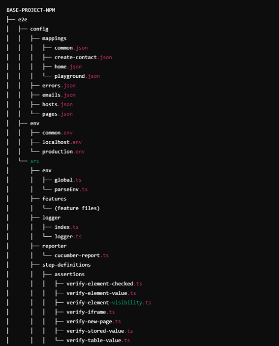
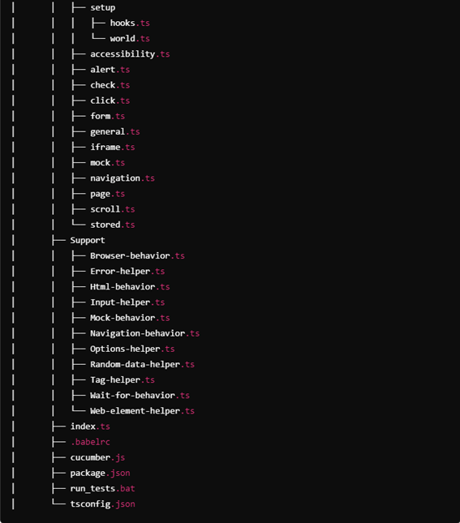
  
</details>

For the purposes of this documentation tutorial, we will be using a test website:

(https://hub.testingtalks.com.au/ )

<details>
  <summary>Click to open testing website image</summary>

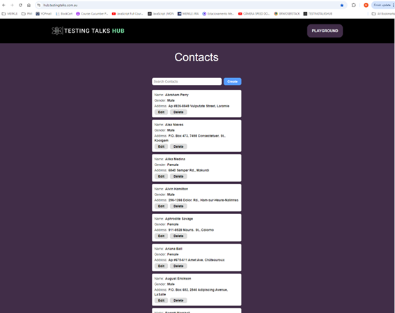

</details>

<a name="index"></a>

## Index
1. [Installation](#installation)

    1.1 [VisualStudioCodeSettings](#visual-studio-code-settings)

2. [e2eFolderLevel](#e2e-folder-level)

    2.1 [ConfigFolder](#config-folder)

    2.1.1 [Mapings](#mappings-folder)


## Installation

Save the project:

Save the project folder “BASE-PROJECT-NPM” in the local disk of your computer and rename it if necessary.


Install Node JS recomended version - (https://nodejs.org/en/download/)

Install Visual Studio Code - (https://code.visualstudio.com)

Open Visual Studio Code:

<details>
<summary>Click to open Visual Studio image</summary>

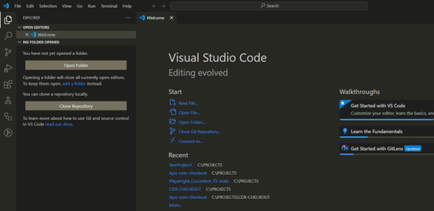

</details>
<br>

Go to Extensions and install the Cucumber (Gherkin) Full Support:

<details>
<summary>Click to open Cucumber extension image</summary>

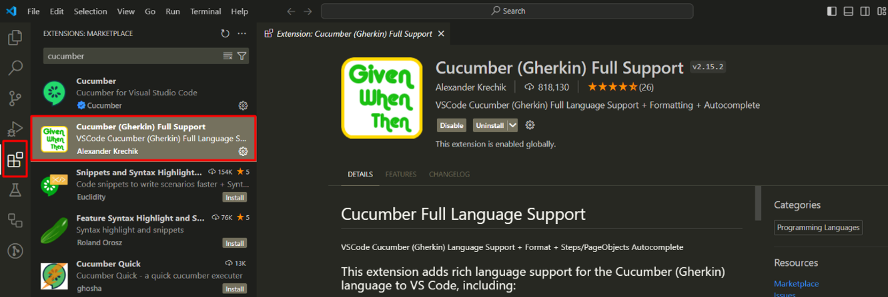

</details>
<br>
 
The following dependencies are already created in the Package.json file:

```ts
{
  "name": "e2e",
  "version": "1.0.0",
  "description": "",
  "main": "index.js",
  "scripts": {
    "precucumber": "rimraf reports && mkdir reports && echo {} > reports/report.json",
    "transpile": "rimraf dist && babel --extensions .ts --out-dir dist src",
    "cucumber": "npm run transpile && cucumber-js",
    "cucumber:localhost": "npm run transpile && cucumber-js",
    "cucumber:production": "npm run transpile && cucumber-js",
    "postcucumber": "cross-env COMMON_CONFIG_FILE=env/common.env ts-node ./src/reporter/cucumber-report.ts"
  },
  "author": "",
  "license": "ISC",
  "devDependencies": {
    "@babel/cli": "^7.25.6",
    "@babel/core": "^7.25.2",
    "@babel/preset-env": "^7.25.4",
    "@babel/preset-react": "^7.24.7",
    "@babel/preset-typescript": "^7.24.7",
    "@cucumber/cucumber": "^10.9.0",
    "@playwright/test": "^1.46.1",
    "@types/body-parser": "^1.19.5",
    "@types/cucumber-html-reporter": "^5.0.1",
    "@types/faker": "^5.5.3",
    "@types/node": "^22.5.1",
    "axe-html-reporter": "^2.2.11",
    "axe-playwright": "^2.0.3",
    "cross-env": "^7.0.3",
    "dotenv": "^16.4.5",
    "faker": "^5.5.3",
    "playwright": "^1.46.1",
    "rimraf": "^6.0.1",
    "ts-node": "^10.9.2",
    "typescript": "^5.5.4"
  },
  "dependencies": {
    "cucumber-html-reporter": "^7.1.1"
  }
}
```
 
These are all the dependencies that we need in the framework structure, to create and execute the test cases and the reports.

Open the Terminal in VS Code:

<details>
<summary>Click to open Terminal access image</summary>

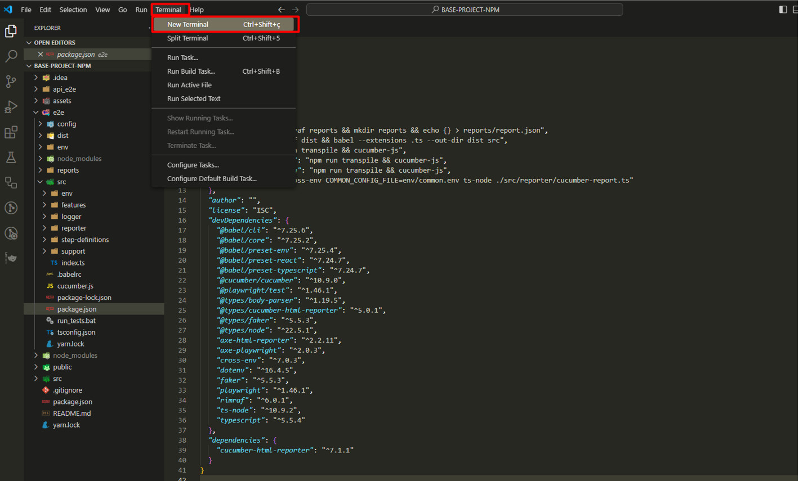

</details>
<br>
 
 The terminal is opened:

<details>
<summary>Click to open Terminal image</summary>

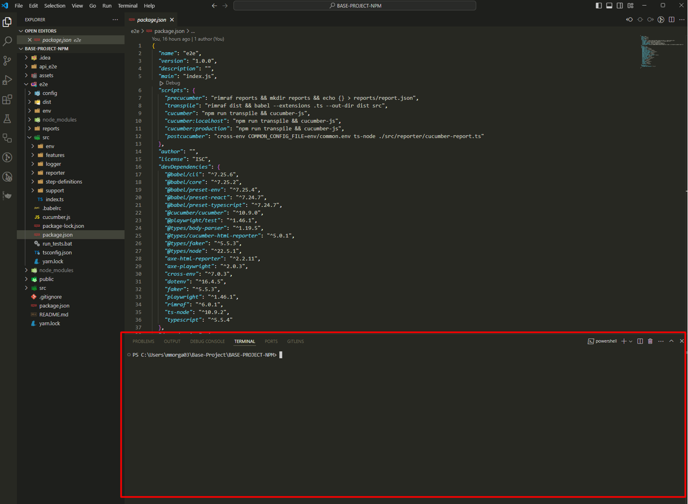

</details>
<br>
 
Navigate to the e2e folder, which is where our end to end project structure is created.

To do this, type “cd e2e” and enter.

The route is now pointing to the e2e folder:

<details>
<summary>Click to open Route image</summary>

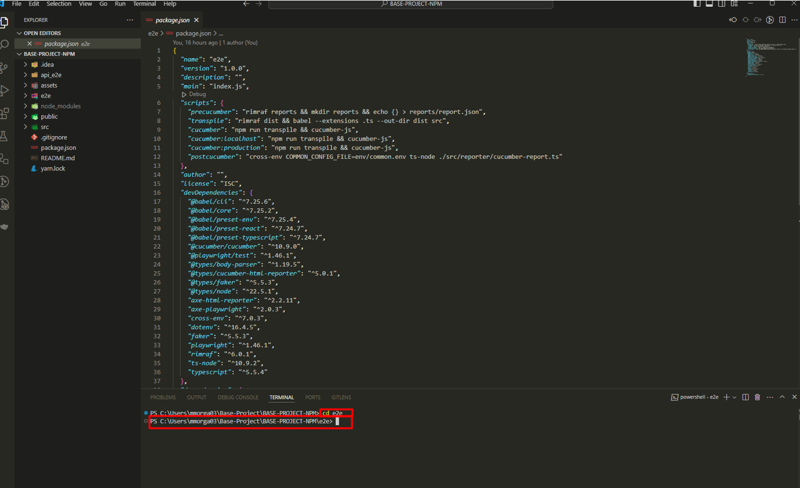

</details>
<br>
 
The dependencies are already in the package.json file, however, they are not installed yet. 

Install the dependencies by writing the following command in the terminal:

To do this, run the command: **npm install** and click **enter**

All the dependencies are now installed.

The project structure inside the e2e folder, looks like this:

<details>
<summary>Click to open Project Structure image</summary>

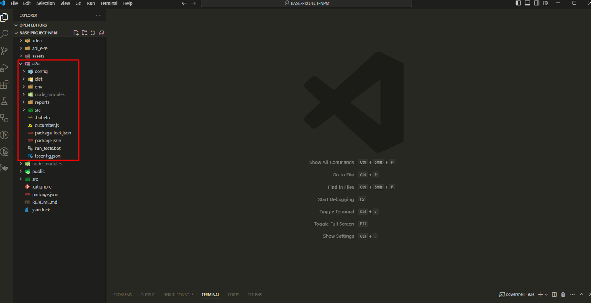

</details>
<br>

## Visual Studio Code settings

Configure the Visual Studio settings.json file, so the cucumber features and the cucumber glue are pointing correctly to our Test Cases features folder and Step definitions.

**Note: Without this configuration, it will not be possible to execute the test cases.**

•	Click CTRL + , to open the settings:
 
<details>
<summary>Click to open Cucumber Settings image</summary>

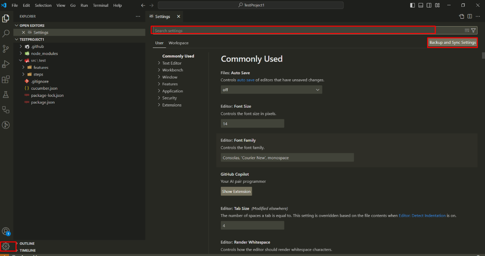

</details>
<br>
  
•	Search for cucumber:
 
<details>
<summary>Click to open Cucumber Search image</summary>

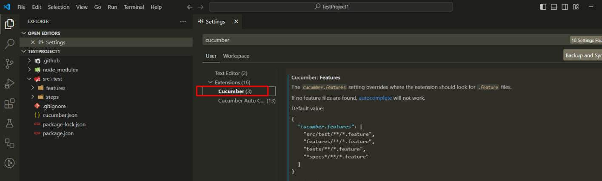

</details>
<br>
 
•	Click in "Editing settings" and define where the feature file is, in Cucumber.Features:

<details>
<summary>Click to open Edit Settings image</summary>

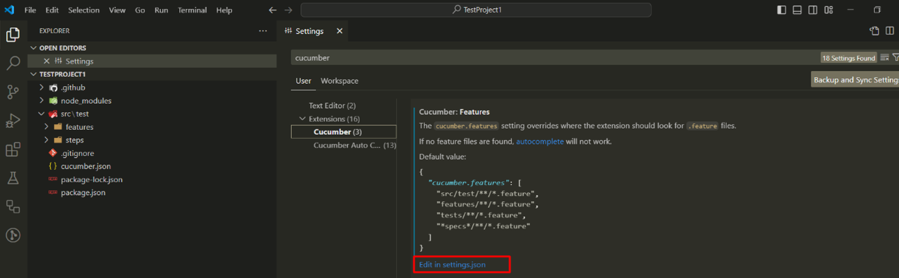

</details>
<br>
  
•	Define where the steps file is in cucumber features and in cucumber.features:


``` ts
"e2e/src/features/*.feature"],
```
<details>
<summary>Click to open Cucumber Feature image</summary>

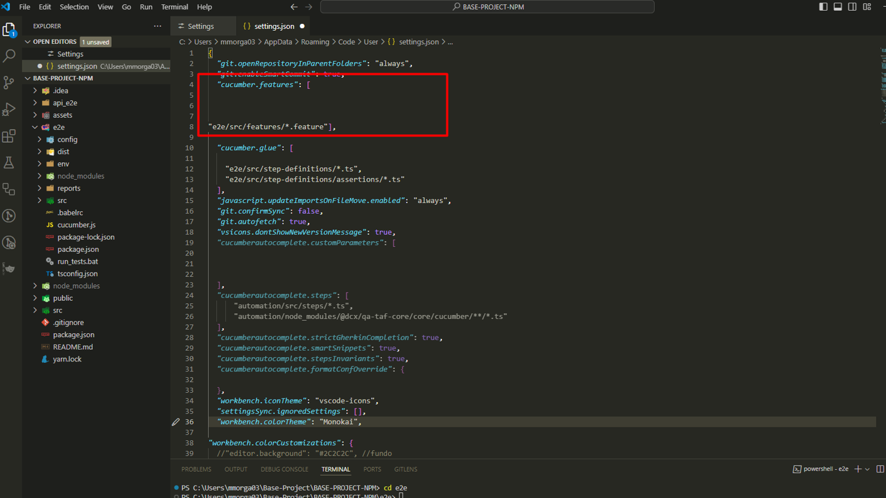

</details>
<br>
 
•	Define where the steps definitions file is, in cucumber.glue:

``` ts
"e2e/src/step-definitions/*.ts",
"e2e/src/step-definitions/assertions/*.ts"
```
<details>
<summary>Click to open Cucumber Glue image</summary>

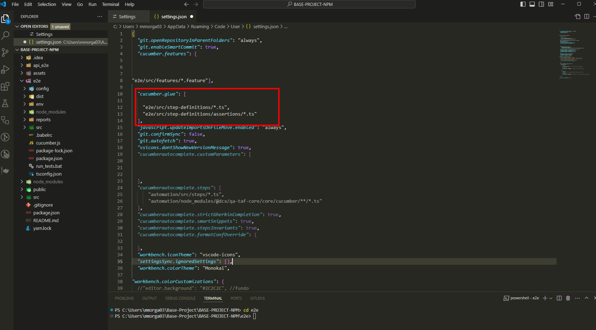

</details>
<br>

### The installation and visual studio configurations are completed.

[Back to Index](#index)


## Folders and files explanation:

### e2e > Config folder:

The config folder contains the folders and files:

- mappings folder
  - common.json file
  - create-contact.json file
  - home.json file
  - playground.json file
- emails.json file
- errors.json file
- hosts.json file
- mocks.json file
- pages.json file

The config folder holds various configuration files that are used to define and manage the behavior, settings, and environment parameters for our test automation project, and it contains:

#### 1 - e2e > Config > Mappings folder:

* Inside the Config folder, we have the Mappings folder, which contains configuration files that map different components, data, or behavior of our automation framework.

**Files of the Mappings folder:**

    A) common.json:

File content:

```ts
{
  "header logo" : "[data-id='header-logo']",
  "search" : "[data-id='search']",
  "contact" : "[data-id='contact']",
  "full name label" : "[data-id='full-name-label']",
  "gender label" : "[data-id='gender-label']",
  "address label": "[data-id='address-label']",
  "address" : "[data-id='address']",
  "edit" : "[data-id='edit-button']",
  "delete" : "[data-id='delete-button']",
  "name" : "[data-id='name']",
  "gender" : "[data-id='gender']",
  "phone" : "[data-id='phone']",
  "street" : "[data-id='street']",
  "city" : "[data-id='city']",
  "save" : "[data-id='save-button']",
  "cancel" : "[data-id='cancel-button']",
  "playground" : "[data-id='playground-button']",
  "no items message" : "[data-id='no-items-message']",
  "error message" : "[data-id='error-message']"
}
```

This file contains mappings of various UI elements to their corresponding selectors. It provides a centralized way to reference elements across different tests and different pages on the website, thus the name “common”. 

Each key is a descriptive label, and each value is a CSS selector (or other selector type) that identifies the corresponding element on the web page.

**Purpose:**
To simplify and standardize the way UI elements are accessed in tests.
Facilitates easier maintenance, as changes to selectors only need to be updated in one place.


    B) create-contact.json:

File content:

```ts
{
  "create contact header" : "[data-id='create-contact-header']"
}
```

This file focus specifically on elements related to creating a new contact.

**Purpose:**
To provide selectors for elements involved in the contact creation process, such as the header of the create contact form.


These selectors are going to be found in the create contact page:

<details>
<summary>Click to open Create-contact-web images</summary>

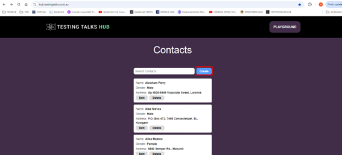
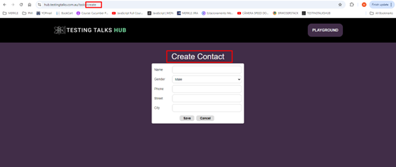

</details>
<br>

    C) home.json:

File content:

```ts
{
  "contacts header" : "[data-id='contacts']",
  "create" : "[data-id='add-button']",
  "search" : "[data-id='search']",
  "full name label" : "[data-id='full-name-label']",
  "gender label" : "[data-id='gender-label']",
  "address label" : "[data-id='address-label']",
  "address" : "[data-id='address']",
  "edit" : "[data-id='edit-button']",
  "delete" : "[data-id='delete-button']"
}
```

This file includes selectors relevant to the home page, for managing or displaying contacts inside the home page.

**Purpose:**
To define selectors for elements on the home page, such as headers, buttons for creating contacts, and fields for contact details. This helps in testing functionalities specific to the home view.


These selectors are going to be found in the Home page:

<details>
<summary>Click to open Home-web image</summary>

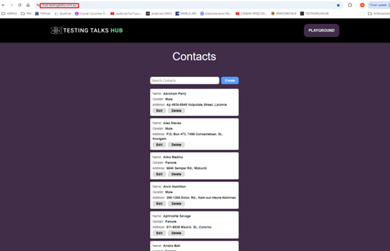

</details>
<br>

    D) playground.json:

File content:

```Ts
{
  "female" : "[value='female']",
  "male" : "[value='male']",
  "female label" : "[data-id='female-radio-button']",
  "male label" : "[data-id='male-radio-button']",
  "movies" : "[id='movies-input']",
  "the godfather" : "//li[text()='The Godfather']",
  "the dark knight" : "//li[text()='The Dark Knight']",
  "outlined required" : "[id='outlined-required']",
  "outlined disabled" : "[id='outlined-disabled']",
  "outlined read only" : "[id='outlined-read-only-input']",
  "outlined error" : "[id='outlined-error-helper-text-label']",
  "outlined error text" : "[id='outlined-error-helper-text-helper-text']",
  "blue" : "[data-id='blue-radio-button']",
  "purple" : "[data-id='purple-radio-button']",
  "green" : "[data-id='green-radio-button']",
  "grey" : "[data-id='grey-radio-button']",
  "red" : "[data-id='red-radio-button']",
  "basic iframe" : "[id='basic-iframe']",
  "new tab" : "[data-id='new-tab-button']",
  "open window" : "[data-id='open-window-button']",
  "primary" : "[data-id='primary-button']",
  "secondary" : "[data-id='secondary-button']",
  "third" : "[data-id='third-button']",
  "my button" : "[data-id='my-button']",
  "basic" : "[data-id='basic-table']",
  "switch one" : "[data-id='switch-one']",
  "switch two" : "[data-id='switch-two']",
  "browser alert" : "[data-id='browser-alert']",
  "error alert" : "[data-id='error-alert']",
  "warning alert" : "[data-id='warning-alert']",
  "info alert" : "[data-id='info-alert']",
  "success alert" : "[data-id='success-alert']",
  "tooltip" : "[data-id='tooltip']",
  "textarea" : "[data-id='textarea']",
  "show hide button" : "[data-id='show-hide-button']",
  "show hide text" : "[data-id='show-hide-text']",
  "first value" : "[data-id='first-value']",
  "second value" : "[data-id='second-value']",
  "third value" : "[data-id='third-value']",
  "fourth value" : "[data-id='fourth-value']",
  "fifth value" : "[data-id='fifth-value']",
  "card header" : "[data-id='card-header']",
  "card main" : "[data-id='card-main']",
  "card type" : "[data-id='card-type']",
  "card overview" : "[data-id='card-overview']",
  "card action" : "[data-id='card-action']",
  "avatar" : "[data-id='avatar']",
  "small avatar" : "[data-id='small-avatar']",
  "drop down button" : "[data-id='drop-down-button']",
  "drop down profile" : "[data-id='drop-down-profile']",
  "drop down my account" : "[data-id='drop-down-my-account']",
  "drop down logout" : "[data-id='drop-down-logout']",
  "age" : "[name='age']",
  "email" : "[data-id='email']",
  "password" : "[data-id='password']",
  "email error" : "[data-id='email-error']",
  "full name" : "[data-id='full-name']"
}
```

This file contains a broader set of selectors, for a variety of UI components that may be used across multiple tests, such as radio buttons, input fields, alerts, and more, inside the page “playground”.

**Purpose:**
To provide a comprehensive set of selectors for various interactive elements within a playground environment.
It supports a range of test scenarios inside the playground page.

These selectors are going to be found in the playground page:

<details>
<summary>Click to open Playground-web images</summary>

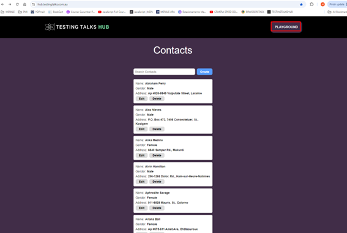

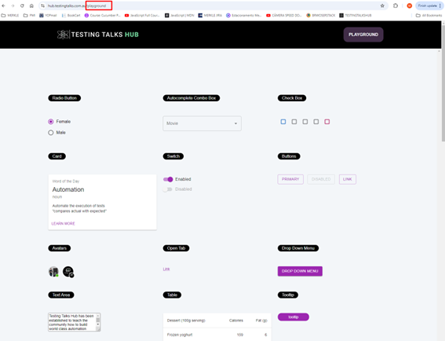

</details>
<br>

**Observations:**

**Centralized Management:** By using these JSON files for mappings, the project allows for centralized management of selectors, which simplifies testing and reduces the risk of errors caused by changes in the UI.

**Readability:** The descriptive keys make it easy to understand what each selector corresponds to, improving the readability of test scripts.

#### 2 - e2e > Config > emails.json file:

File content:

```Ts
{
    "TEST_EMAIL" : "admin@testingtalkshub.com.au"
  }
```

This file contains email-related configurations, specifically for testing purposes (to be used ahead in our tests).

**Purpose:** It provides a designated email address to be used in tests, ensuring consistency and reliability in scenarios that require email interactions.


#### 3 - e2e > Config > errors.json file:

File content:

```ts
[
    {
      "originalErrMsgRegexString": "Wait time of [0-9]+ms for [a-zA-Z0-9 ]+exceeded",
      "parsedErrMsg": "🧨 Timed out waiting for the '{}' <> 🧨"
    },
    {
      "originalErrMsgRegexString" : "Cannot read properties of undefined (.*)",
      "parsedErrMsg" : "🧨 Unable to find the '{}' <> mapping 🧨"
    }
  ]
```

This file defines error messages to be used in the automation tests.

**Purpose:** It maps original error message patterns (using regex) to more user-friendly messages. This aids in debugging by making errors clearer and easier to understand during test failures.


#### 4 - e2e > Config > hosts.json file:

File content:

```ts
{
    "localhost": "http://localhost:3000/",
    "production": "https://hub.testingtalks.com.au/",
    "api" : "https://jsonplaceholder.typicode.com/"
  }
```

This file defines different host URLs for various environments.

**Purpose:** It centralizes the URLs for different environments, enabling easy switching between local development and production environments, as well as providing an API endpoint for tests. (For now, ignore the api)

#### 5 - e2e > Config > mocks.json file:

File content:

```Ts
{
    "users": "users"
  }
```

This file is used for mocking data in tests.

**Purpose:** It specifies entities to be mocked during tests. In this case, its referring to a "users" object, which will be used to simulate user-related data in various scenarios.

#### 6 - e2e > Config > pages.json file:

File content:

```ts
{
  "home": {
    "route": "/",
    "regex": "^/$"
  },
  "create contact": {
    "route": "/tasks/create",
    "regex": "^/tasks/create"
  },
  "playground" : {
    "route" : "/playground",
    "regex" : "^/playground"
  },
  "edit contact": {
    "route" : "/edit",
    "regex" : "^/tasks/\\d+/edit"
  }
}
```

This file defines application routes and corresponding regex patterns for different pages.

**Purpose:** It helps in identifying the structure and navigation of the application. Each entry contains a route to navigate to and a regex to match the URL pattern, which will be useful for assertions in tests.

Ex:

Home page:

<details>
<summary>Click to open home-page-example image</summary>

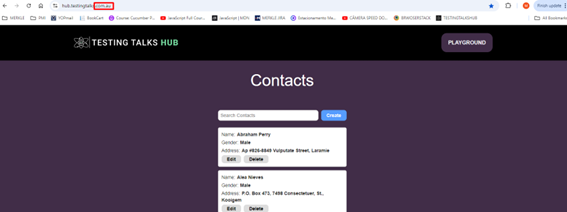

</details>
<br>

Playground page:

<details>
<summary>Click to open playground-page-example image</summary>

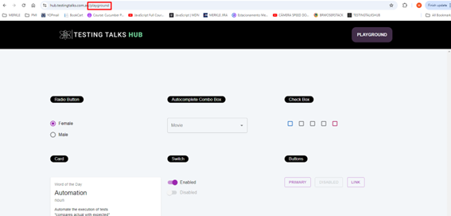

</details>
<br>

[Back to Index](#index)

# END OF CONFIG FOLDER SECTION!!!

### e2e > .babelrc file:

Inside the e2e folder level, we have the following configuration file:

    .babelrc

File content:

```ts
{
    "presets": ["@babel/preset-typescript", "@babel/preset-env"]
}
```

<details>
<summary>Click to open .babelrc code description</summary>
<br>

The .babelrc file is a configuration file for Babel, a JavaScript compiler that allows us to use the latest JavaScript features and TypeScript in our project. 

Here's a breakdown of the contents of our .babelrc file:

Explanation of the Presets:

1.	@babel/preset-typescript
o	This preset enables Babel to understand TypeScript syntax. It allows you  to write your code in TypeScript and compiles it down to plain JavaScript, which can be executed in environments that do not support TypeScript directly.
o	It primarily strips away TypeScript-specific features (like type annotations) but does not perform type-checking. For type-checking, you would still need to run the TypeScript compiler separately (using tsc).

2.	@babel/preset-env
o	This preset allows you to use the latest JavaScript features without worrying about which syntax transformations are needed for the environments you want to support (like older browsers).
o	It automatically determines the transformations and polyfills required based on your specified browser or environment support.

•	.babelrc file is essentially a JSON object that defines configuration settings for Babel. 
•	When you run Babel (for example, during a build process or when you transpile your code), Babel reads this configuration file to understand how to process your JavaScript and TypeScript files.

How It Works:

1.	Babel CLI/Build Tool Integration: When you invoke Babel (either through the command line or through a build tool like Webpack, Gulp, or others), it automatically looks for the .babelrc file in your project directory.

2.	Loading the Configuration: Babel reads the settings specified in the .babelrc file. In this case, it sees that it should use the @babel/preset-typescript and @babel/preset-env.

3.	Transpiling Code: Based on this configuration, Babel processes your code, transforming modern JavaScript and TypeScript syntax into a version that can be executed in the environments you want to support.

Example in Practice:

For example, if you have a TypeScript file that uses modern JavaScript features and type annotations, when you run Babel:

•	It will strip out the type annotations (due to @babel/preset-typescript).

•	It will also transform any modern JavaScript features (like arrow functions or async/await) into a format compatible with older browsers (thanks to @babel/preset-env).

</details>
<br>

### e2e > src > env folder:

The env folder contains the files:

- global.ts;
- parseEnv.ts.

The env folder serves as a hub for managing environmental configurations and shared types, ensuring that the automation framework or project has access to the right settings and utilities, regardless of the environment it's operating in.

    parseEnv.ts file:

File content:

This file is focused on retrieving environment variables and reading JSON data from files. It has two main functionalities: 

- Accessing environment variables;
- Handling file-based JSON data. 

```ts
export const getJsonFromFile = <T = Record<string, string>>(path: string): T => {
    return require(`${process.cwd()}${path}`);
};

export const env = (key: string): string => {
    const value = process.env[key]
    if (!value) {
        throw Error(`No environment variable found for ${key}`)
    }
    return value;
}

export const envNumber = (key: string): number => {
    return Number(env(key));
};
```

<details>
<summary>Click to open parseEnv.ts code description</summary>
<br>

1:
```ts
export const getJsonFromFile = <T = Record<string, string>>(path: string): T => {
```
***export const:*** This is declaring a constant function and exporting it, which means this function can be used in other files when they import it.

***getJsonFromFile:*** The name of the function. It retrieves and returns the contents of a JSON file.

***<T = Record<string, string>>:*** This is a generic type in TypeScript. It allows the function to return data of any specified type. If no specific type is provided when calling the function, it defaults to returning an object where the keys are strings and the values are strings (Record<string, string>).

***(path: string): T:*** This means the function takes one argument, path, which is a string representing the file path of the JSON file. The function returns data of type T (a generic type).

2: 
```ts
return require(`${process.cwd()}${path}`);
```

***require():*** This is a way to load external files (like JSON files). It is part of Node.js, which is commonly used in Playwright/TypeScript projects. Here, it's used to read the contents of the file at the given path.

***${process.cwd()}:*** This gets the current working directory (the folder where the project is running). cwd stands for "current working directory."

- Template literals (${}): The ${} syntax inside backticks (``) allows you to inject variables or expressions into a string.

- process.cwd() + ${path}: Combines the current working directory with the path provided to get the full path to the JSON file.

***Purpose:*** This line loads the JSON file located at the specified path and returns its contents.

3:
```ts
export const env = (key: string): string => {
```
***export const:*** This is declaring a constant function and exporting it, which means this function can be used in other files when they import it.

***env:*** This is the name of the function. It retrieves the value of an environment variable.

***(key: string):*** string: This means the function takes one argument, key, which is a string (the name of the environment variable). The function returns a string (the value of the environment variable).

4:
```ts
const value = process.env[key]
```

***process.env:*** This is a built-in object in Node.js that contains all the environment variables (key-value pairs) for the current running environment.

- Environment variables are used to store configuration values, like API keys, database URLs, or other settings, outside of your code.

***process.env[key]:*** This retrieves the value of the environment variable with the name key.

5:
```ts
if (!value) {
```

This checks if the value is undefined, null, or an empty string. If the value does not exist, the code inside the block will execute.

6: 
```ts
throw Error('No environment variable found for ${key}')
```

***throw Error():*** This creates a new error and stops the execution. If no value is found for the specified environment variable, this line throws an error with a custom message saying that the variable is missing.

***Purpose:*** To ensure that the environment variable exists, and if not, notify the user by throwing an error.

7:
```ts
return value;
```

If the environment variable exists, it returns the value. This allows other parts of the program to use the retrieved value.

8:
```ts
export const envNumber = (key: string): number => {
```

This defines another function called envNumber, which is similar to env but is specifically designed to return a number instead of a string.

***(key: string): number:*** It takes one argument, key (the name of the environment variable), and returns a number.

9:
```ts
return Number(env(key));
```

***env(key):*** This calls the env function defined earlier to get the value of the environment variable.

***Number():*** This converts the value returned by env(key) (which is a string) into a number. If the value cannot be converted to a valid number, it will return NaN (Not-a-Number).

***Purpose:*** This function is used when you expect an environment variable to be a numeric value (like width, height, port numbers, etc.).

***Summary:***

***getJsonFromFile:*** This function loads and returns the contents of a JSON file from the file system, making it easier to use external configurations.

***env:*** Retrieves a string value from environment variables, throwing an error if the variable is not found.

***envNumber:*** Retrieves a value from environment variables and converts it to a number, ensuring that numerical configurations (like screen size or timeout limits) are properly handled.

These functions are typically used in automation frameworks to handle configurations dynamically, allowing you to change settings (like screen sizes, API keys, etc.) without modifying the actual code.


</details>
<br>

    global.ts file:

This file defines a set of types and interfaces that are used across the entire project to ensure consistency, especially when dealing with configurations, error handling, and page elements in our automation framework.
It's like a blueprint that specifies what data is available, how it’s structured, and what kind of operations are allowed on it.

The primary purpose of this file is to:

- Define global types for managing different parts of our automation framework.
- Ensure type safety when dealing with configurations, mappings, and errors.
- Create reusable structures to avoid duplication across the project.
- Standardize the handling of mock data, page elements, and configurations.

File content:

```ts
export type PageId = string
export type ElementKey = string
export type ElementLocator = string
export type WaitForTargetType = string
export type MockConfigKey = string
export type MockServerKey = string
export type MockPayloadKey = string
export type WaitForTarget = PageId | ElementKey
export type PageElementMappings = Record<PageId, Record<ElementKey, ElementLocator>>
export type MockPayloadMappings = Record<string, string>
export type PagesConfig = Record<PageId, Record<string, string>>
export type HostsConfig = Record<string, string>
export type ErrorsConfig = ErrorConfig[]
export type MocksConfig = Record<string, string>
export type GlobalVariables = { [key: string]: string }
export type EmailsConfig = Record<string, string>

export type ErrorConfig = {
    originalErrMsgRegexString: string
    parsedErrMsg: string
}

export type GlobalConfig = {
    pageElementMappings: PageElementMappings
    mockPayloadMappings: MockPayloadMappings
    hostsConfig: HostsConfig
    pagesConfig: PagesConfig
    errorsConfig: ErrorsConfig
    emailsConfig: EmailsConfig
    mocksConfig: MocksConfig
};
```

<details>
<summary>Click to open global.ts code description</summary>
<br>

1. Basic Type Aliases

*A type alias in TypeScript is a way to give a name to a type. This helps make the code easier to read and maintain. Think of it like creating shortcuts for certain types of data that will be used frequently.*

```ts
export type PageId = string
export type ElementKey = string
export type ElementLocator = string
export type WaitForTargetType = string
export type MockConfigKey = string
export type MockServerKey = string
export type MockPayloadKey = string
export type WaitForTarget = PageId | ElementKey
```

- PageId, ElementKey, ElementLocator: These define specific types for page IDs, element keys, and locators within our automation framework.

- WaitForTarget: This type allows us to wait for either a PageId or ElementKey—useful for targeting specific elements or pages.

- MockConfigKey, MockServerKey, MockPayloadKey: These are related to mock data handling, assigning string types for keys used in mock configurations and servers.

What does this mean?

PageId:

PageId is just another name for string.
It represents the ID of a page in our application. For example, the homepage might have an ID like "HomePage".
By creating this alias, we make it clear that when we use PageId, we're referring specifically to a page’s identifier.

ElementKey:

Also a string, but this refers to the name or key for an element on a webpage, such as a button, a text box, or a link.
For instance, the key for a login button might be "loginButton".

ElementLocator:

This is a string that represents the location of an element on a page.
It's typically a CSS selector or XPath used by automation tools like Playwright to interact with that element. 

Example: "#loginButton" could be the locator for a button with the ID loginButton.

WaitForTarget:

This type says that a WaitForTarget can be either a PageId or an ElementKey.
This means in our code, when we want to wait for something (like a page or an element to load), we can use either a page ID or an element key.

2. Mappings and Configuration Types

```ts
export type PageElementMappings = Record<PageId, Record<ElementKey, ElementLocator>>
export type MockPayloadMappings = Record<string, string>
export type PagesConfig = Record<PageId, Record<string, string>>
export type HostsConfig = Record<string, string>
export type ErrorsConfig = ErrorConfig[]
export type MocksConfig = Record<string, string>
export type GlobalVariables = { [key: string]: string }
export type EmailsConfig = Record<string, string>

```

- PageElementMappings: Defines a structure for mapping page elements. It's a dictionary where each PageId contains a dictionary of ElementKey-to-ElementLocator mappings. 
This is used to store and retrieve the locators for elements on different pages.

**What does this mean?**

Record<PageId, Record<ElementKey, ElementLocator>>: This is a mapping or dictionary. Think of it like a table that connects pages, elements, and their locators.

Here’s how it works:

The outer Record<PageId, Record<ElementKey, ElementLocator>> is saying: “I have a list of pages, and for each page, I have a list of elements and their locators.”
Inside each page (identified by PageId), there’s another dictionary (Record<ElementKey, ElementLocator>) that maps each element (identified by ElementKey) to a locator (ElementLocator).

- MockPayloadMappings: A dictionary for storing mock payloads, used when mocking server responses.

This defines a mapping between some kind of identifier and a piece of mock data. It’s used when we want to simulate server responses in tests without hitting the actual server.

- PagesConfig: Stores configuration for each page, where the key is PageId and the value is a set of key-value pairs (often used for custom page settings).

- HostsConfig: Maps different hostnames or URLs for different environments (e.g., dev, test, production).

- ErrorsConfig: A list of ErrorConfig objects, used to define and handle specific error configurations (see the ErrorConfig section below).

- MocksConfig: A dictionary of mock data configurations, which could be used to set up fake data responses for tests.

- GlobalVariables: A key-value pair object where both keys and values are strings, used to store global variables in your project.

- EmailsConfig: This might store email addresses or other email-related configurations.

3. Error Handling Configuration

```ts
export type ErrorConfig = {
    originalErrMsgRegexString: string
    parsedErrMsg: string
}

```

- ErrorConfig: Defines a structure for error handling. It includes:
    - originalErrMsgRegexString: A regex pattern to match specific error messages.

    - parsedErrMsg: The parsed or more user-friendly version of the error message.

This can be used to catch, parse, and reformat errors during our automation testing.

4. Global Configuration

```ts
export type GlobalConfig = {
    pageElementMappings: PageElementMappings
    mockPayloadMappings: MockPayloadMappings
    hostsConfig: HostsConfig
    pagesConfig: PagesConfig
    errorsConfig: ErrorsConfig
    emailsConfig: EmailsConfig
    mocksConfig: MocksConfig
};

```
GlobalConfig: This is a central structure that ties all of the other configurations together. It holds all the different mappings and configurations we need in one place.

- Page Element Mapping: This allows us to map specific page elements (like buttons, text fields, etc.) to locators dynamically. This is useful for managing locators in a single place rather than hardcoding them in each test.
**Note:** pageElementMappings is a variable or property, and it is expected to follow the type alias PageElementMappings.

- Mock Data Handling: The mock payload mappings and configuration are used to mock API responses or server behavior during tests, ensuring that we can test without relying on actual server responses.

- Error Handling: The error configuration provides a way to capture specific error patterns and convert them into more meaningful error messages, improving test reporting and debugging.

- Global Settings: GlobalConfig consolidates all the configurations so that our tests have easy access to the necessary information without scattering it across different files.


**Summary:**

- Type Aliases: Help define the kinds of data you’re working with, such as page IDs, element locators, or mock payloads.
- Mappings: Create connections between different pieces of data, such as page elements and their locators or mock requests and their responses.
- Configurations: Provide settings and error-handling rules for your automation framework, making it easier to maintain and scale your project.

**Conclusion:**

- **Consistency:** The types defined here allow us to manage page elements, error handling, mock data, and configuration in a consistent way throughout the project.

- **Flexibility:** The use of Record<string, string> types allows for flexibility in how we map data and configurations.

- **Centralized Configuration:** By using GlobalConfig, we keep all the critical settings and mappings in one place, making it easier to manage and modify over time.


</details>
<br>

[Back to Index](#index)


### e2e > src > step-definitions > setup folder:

The setup folder contains the file:

- world.ts

    world.ts file:

File content:

This file acts as the bridge between our BDD tests (written in Cucumber) and the browser automation tool (Playwright), providing the necessary setup, configuration, and browser management for our tests to run smoothly.

```ts
import playwright, {
    BrowserContextOptions,
    Page,
    Browser,
    BrowserContext,
    BrowserType
} from "playwright";
import { env } from '../../env/parseEnv'
import { World, IWorldOptions, setWorldConstructor} from "@cucumber/cucumber";
import { GlobalConfig, GlobalVariables } from '../../env/global';

export type Screen = {
    browser: Browser;
    context: BrowserContext;
    page: Page;
}

export class ScenarioWorld extends World {
    constructor(options: IWorldOptions) {
        super(options)

        this.globalConfig = options.parameters as GlobalConfig;
        this.globalVariables = {};
    }

    globalConfig: GlobalConfig;

    globalVariables: GlobalVariables;

    screen!: Screen;

    async init(contextOptions?: BrowserContextOptions): Promise<Screen> {
        await this.screen?.page?.close();
        await this.screen?.context?.close()
        await this.screen?.browser?.close()

        const browser = await this.newBrowser();
        const context = await browser.newContext(contextOptions)
        const page = await context.newPage();

        this.screen = { browser, context, page };

        return this.screen
    }

    private newBrowser = async (): Promise<Browser> => {

        const automationBrowsers = ['chromium', 'firefox', 'webkit']
        type AutomationBrowser = typeof automationBrowsers[number]
        const automationBrowser = env('UI_AUTOMATION_BROWSER') as AutomationBrowser

        const browserType: BrowserType = playwright[automationBrowser];
        const browser = await browserType.launch({
            devtools: process.env.DEVTOOLS !== 'false',
            headless: process.env.HEADLESS !== 'false',
            args: ['--disable-web-security', '--disable-features=IsolateOrigins, site-per-process'],
        })
        return browser;
    }

}

setWorldConstructor(ScenarioWorld)
```

<details>
<summary>Click to open world.ts code description</summary>
<br>

Imports:
```ts
import playwright, {
    BrowserContextOptions,
    Page,
    Browser,
    BrowserContext,
    BrowserType
} from "playwright";
import { env } from '../../env/parseEnv'
import { World, IWorldOptions, setWorldConstructor} from "@cucumber/cucumber";
import { GlobalConfig, GlobalVariables } from '../../env/global';

```

- import playwright {...}: This imports playwright and some of its types. Playwright is a Node.js library that allows us to automate browser interactions. These types (Browser, Page, etc.) are used to control the browser and its contexts (tabs, cookies, sessions).

- env: This is a custom function from our parseEnv.ts file, used to read environment variables (like configurations).

- World, IWorldOptions, setWorldConstructor: These are imported from Cucumber. Cucumber is a tool used for Behavior-Driven Development (BDD). It allows writing tests in plain English (Gherkin syntax), and World is a class that provides context for each scenario. setWorldConstructor allows customizing the World.

- GlobalConfig, GlobalVariables: These are types imported from our global.ts file. GlobalConfig holds various configurations, and GlobalVariables holds global variables (for storing data during the test session).

**Type Definitions:**
```ts
export type Screen = {
    browser: Browser;
    context: BrowserContext;
    page: Page;
}
```
- Screen: This is a TypeScript type alias that defines a structure containing:
    - browser: This is an instance of a browser.
    - context: This is the browser's context, which represents an isolated environment (like a tab) within the browser.
    - page: This represents the web page that the browser opens and interacts with.

**The ScenarioWorld class:**
```ts
export class ScenarioWorld extends World {
    constructor(options: IWorldOptions) {
        super(options)
        this.globalConfig = options.parameters as GlobalConfig;
        this.globalVariables = {};
    }

    globalConfig: GlobalConfig;
    globalVariables: GlobalVariables;
    screen!: Screen;
```

- ScenarioWorld class: This extends the World class from Cucumber. It customizes what happens in each scenario, storing configurations and variables needed for the tests.

**Context:** Class Inheritance in TypeScript (or JavaScript)
In object-oriented programming (OOP), inheritance allows a class to inherit properties and methods from another class. This is useful because it lets us reuse code and create specialized versions of generic classes.

When you create a class in TypeScript or JavaScript using the class keyword, you can extend (inherit from) another class using the extends keyword. When a class inherits from another class, the parent class is often referred to as the "superclass" and the child class as the "subclass."

In our case, ScenarioWorld is a subclass, and it inherits from the World class provided by the @cucumber/cucumber library.

- constructor(options: IWorldOptions): The constructor gets called when a new instance of ScenarioWorld is created for each scenario.


_The constructor is a special method in classes that gets called when we create a new instance of the class. It’s where you set up the initial state of an object._

_It is called automatically when an instance (or object) of a class is created. It allows us to initialize properties or execute any setup code we need when the object is instantiated. In TypeScript, constructors are often used to initialize variables or objects and pass in any necessary configurations or data._

_In the context of the ScenarioWorld class, the constructor is used to initialize the test's environment. It sets up the necessary configurations and prepares the class for running the test scenario._

_Parent Class (World)_
_The World class in Cucumber is the base class that gives access to shared data or context for all steps in a test scenario. This class might include properties and methods to help manage data during the test execution._

_When we extend the World class to create our ScenarioWorld class, we want to make sure that the base functionality provided by World is still available in our custom class._

- super(options): This calls the parent World class's constructor to inherit its properties.

**super(options): Why It’s Needed:**
The super() function in the constructor is necessary when our class extends another class. It ensures that the parent class's constructor gets called so that the inherited properties and methods are correctly set up. Without this call to super(), the child class (ScenarioWorld in this case) wouldn't properly inherit the initialization logic of the parent class (World).

**What does super(options) do here?**
***In our case:***

```ts
constructor(options: IWorldOptions) {
    super(options)
    this.globalConfig = options.parameters as GlobalConfig;
    this.globalVariables = {};
}
```

- constructor(options: IWorldOptions): This defines the constructor of the ScenarioWorld class. It takes in a parameter options of type IWorldOptions.
- super(options): This line calls the constructor of the World class (the parent class) and passes the options parameter to it.
This ensures that the World class can do its necessary setup with the options object.
It might initialize certain properties or prepare internal logic for Cucumber to work correctly.
Without calling super(options), our ScenarioWorld class wouldn’t have access to any of the properties and methods that World provides.

Example to Illustrate super() in Simple Terms
Here’s a simplified analogy of what’s happening:

_Imagine the World class is like a blueprint for building a generic test environment. It has some predefined settings and tools (like a shared context, or scenario data).
You create your own specialized blueprint, ScenarioWorld, but you still want to use the tools and settings from the original World blueprint.
By calling super(), you are saying, "Hey, use the parent blueprint first to set everything up, and then I’ll add my customizations afterward."
Practical Usage in Your ScenarioWorld
In Cucumber, the World class provides a test context that is shared between the different steps of a scenario. By inheriting from it, your ScenarioWorld gains access to that shared context, but you can also add your own custom logic and properties (like globalConfig and globalVariables)._

**Full Breakdown of our constructor:**

```ts
constructor(options: IWorldOptions) {
    super(options)  // Calls the constructor of the parent class (World) to set up inherited functionality.
    
    // Custom properties for the ScenarioWorld
    this.globalConfig = options.parameters as GlobalConfig;  // Stores test configurations in a typed variable
    this.globalVariables = {};  // Initializes an empty object to hold global variables during the scenario
}

```
- constructor(options: IWorldOptions): This is the constructor for your ScenarioWorld class. It's invoked when you create a new instance of ScenarioWorld and passes in options (which holds configuration data for the test).

- super(options): This calls the constructor of the World class with options, ensuring that all the necessary setup from the parent class happens. It may initialize any shared test context, settings, or other necessary things defined in World.

- this.globalConfig = options.parameters as GlobalConfig;: This line assigns the parameters from the options object to globalConfig. These parameters could be the specific configurations needed for your test, like URLs, timeouts, or other settings.

- this.globalVariables = {};: This initializes an empty object for storing variables that might be shared across multiple test steps in a single scenario. These variables could be things like user data, tokens, or any other runtime information.

***Key Takeaways:***

super(options) ensures that the parent class (World) is initialized with the provided options, so you don't lose any functionality from Cucumber's base class.
Inheritance helps reuse logic from the parent class (World) while still allowing custom logic in ScenarioWorld.
The constructor in ScenarioWorld allows us to initialize custom properties (globalConfig and globalVariables) that will be used in our test scenarios.

The init method:
```ts
    async init(contextOptions?: BrowserContextOptions): Promise<Screen> {
        await this.screen?.page?.close();
        await this.screen?.context?.close()
        await this.screen?.browser?.close()

        const browser = await this.newBrowser();
        const context = await browser.newContext(contextOptions)
        const page = await context.newPage();

        this.screen = { browser, context, page };

        return this.screen
    }
```

- init(contextOptions?: BrowserContextOptions): This is an asynchronous method that initializes a browser session for the test.
It first checks if there’s already an open browser, page, or context, and closes them to start fresh.
- this.newBrowser(): This method (explained below) launches a new browser.
- browser.newContext(contextOptions): Creates a new browser context (essentially a new tab).
- context.newPage(): Opens a new page in the context (this is the actual web page we interact with).
- Finally, this.screen = { browser, context, page }; assigns the new browser, context, and page to this.screen.

The newBrowser method:

```ts
private newBrowser = async (): Promise<Browser> => {
    const automationBrowsers = ['chromium', 'firefox', 'webkit'];
    type AutomationBrowser = typeof automationBrowsers[number];
    const automationBrowser = env('UI_AUTOMATION_BROWSER') as AutomationBrowser;

    const browserType: BrowserType = playwright[automationBrowser];
    const browser = await browserType.launch({
        devtools: process.env.DEVTOOLS !== 'false',
        headless: process.env.HEADLESS !== 'false',
        args: ['--disable-web-security', '--disable-features=IsolateOrigins, site-per-process'],
    });
    return browser;
};
```
- newBrowser(): This method launches a new browser instance.
- const automationBrowsers = ['chromium', 'firefox', 'webkit']: This array lists the browsers supported by Playwright (chromium is the core behind Chrome, firefox for Firefox, and webkit for Safari).

- env('UI_AUTOMATION_BROWSER') as AutomationBrowser: Reads an environment variable called UI_AUTOMATION_BROWSER (set in our environment) to decide which browser to use (e.g., 'chromium', 'firefox', or 'webkit').

- playwright[automationBrowser]: This dynamically gets the browser type from the Playwright module (chromium, firefox, or webkit).

- browserType.launch({...}): Launches the selected browser with specific options:

- devtools: process.env.DEVTOOLS !== 'false': Opens the browser's developer tools unless an environment variable DEVTOOLS is explicitly set to false.
- headless: process.env.HEADLESS !== 'false': If HEADLESS is not false, the browser will run in "headless" mode (without a visible UI).
- args: ['--disable-web-security', ...]: These arguments disable certain browser security features.

Final Line:

```ts
setWorldConstructor(ScenarioWorld);
```

This registers ScenarioWorld as the custom World constructor for Cucumber. Each time a new scenario starts, an instance of ScenarioWorld will be created, providing all the necessary setup for each test run.

**Summary:**

- **Imports:** Brings in necessary modules from Playwright, Cucumber, and our own configuration files.

- **ScenarioWorld class:** Extends Cucumber's World class to manage browser interactions and scenario-specific data.
- **Screen:** Defines how browser, context, and page are grouped together.

- **init method:** Starts a fresh browser session and opens a page for each scenario.

- **newBrowser method:** Launches a new browser based on the environment configuration.


</details>
<br>

[Back to Index](#index)


