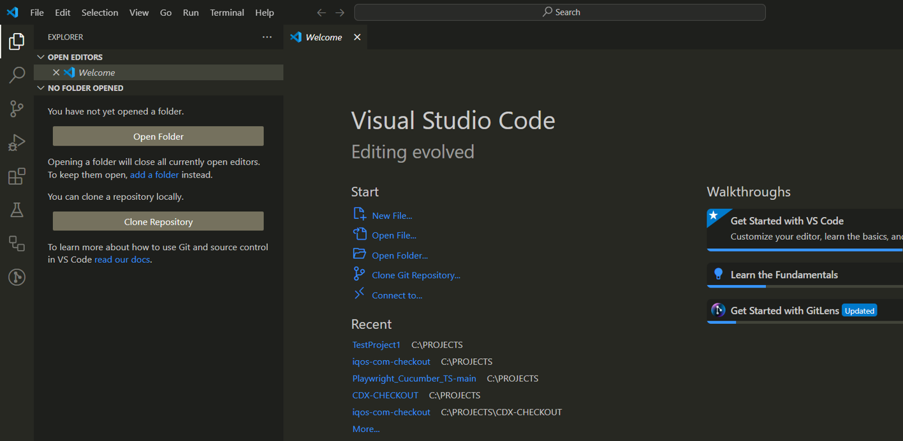

# Playwright + cucumber + typescript

The purpose of this documentation is to explain how we can use an existing automation base structure, in any web automation project.
Its important to know that there are multiple ways of structuring a playwright + cucumber automation, and this is just one of them.

* SAVE THE PROJECT:

Save the project folder “BASE-PROJECT-NPM” in the local disk of your computer and rename it for a project name that makes sense to you.

## Installation
<!-- Foldable section starts here -->

* Install Node JS recomended version - (https://nodejs.org/en/download/)

* Install Visual Studio Code - (https://code.visualstudio.com)

* Open Visual Studio Code:

 
  
* Go to Extensions and install the Cucumber (Gherkin) Full Support:
  
 
The following dependencies are already created in the Package.json file:

 
These are all the dependencies that we need in the framework structure, to create and execute the test cases and the reports.
5 – Open the Terminal in VS Code:

 
 The terminal is opened:

 
6 – Navigate to the e2e folder, which is where our end to end project structure is created.
To do this, type “cd e2e” and enter.
The route is now pointing to the e2e folder:

 
The dependencies are already in the package.json file, however, they are not installed yet. 

7  - Install the dependencies by writing the following command in the terminal:

“npm install”

8 - Then click enter.

All the dependencies are now installed.

The project structure inside the e2e folder, looks like this:

 

9 – Configure the Visual Studio settings.json file, so the cucumber features and the cucumber glue are pointing correctly to our Test Cases features folder and Step definitions.
Note: Without this configuration, it will not be possible to execute the test cases.
•	Click CTRL + , to open the settings:
 
 
 
•	Search for cucumber:
 
 
 
•	Click in "Editing settings" and define where the feature file is, in Cucumber.Features:
 
 
  
•	Define where the steps file is in cucumber features and in cucumber.features:
e2e/src/features/*.feature"],
 

•	Define where the steps definitions file is, in cucumber.glue:
    "e2e/src/step-definitions/*.ts",
    "e2e/src/step-definitions/assertions/*.ts"
 

The installation and visual studio configurations are completed.
<!-- Foldable section ends here -->

