# Playwright + cucumber + typescript

The purpose of this documentation is to explain how we can use an existing automation base structure, in any web automation project.
Its important to know that there are multiple ways of structuring a playwright + cucumber automation, and this is just one of them.

**Project Structure:**
<details>
  <summary>Click to open project structure images</summary>
  


  
</details>

For the purposes of this documentation tutorial, we will be using a test website:

(https://hub.testingtalks.com.au/ )

<details>
  <summary>Click to open testing website image</summary>


</details>

<a name="index"></a>

## Index
1. [Installation](#installation)

    1.1 [VisualStudioCodeSettings](#visual-studio-code-settings)

2. [e2eFolderLevel](#e2e-folder-level)

    2.1 [ConfigFolder](#config-folder)

    2.1.1 [Mapings](#mappings-folder)


## Installation

Save the project:

Save the project folder “BASE-PROJECT-NPM” in the local disk of your computer and rename it if necessary.


Install Node JS recomended version - (https://nodejs.org/en/download/)

Install Visual Studio Code - (https://code.visualstudio.com)

Open Visual Studio Code:

<details>
<summary>Click to open Visual Studio image</summary>


</details>
<br>

Go to Extensions and install the Cucumber (Gherkin) Full Support:

<details>
<summary>Click to open Cucumber extension image</summary>


</details>
<br>
 
The following dependencies are already created in the Package.json file:

<details>
<summary>Click to open package.json image</summary>

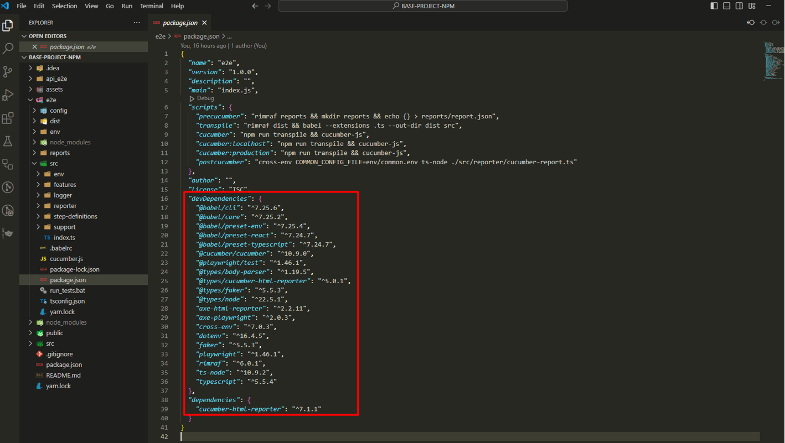

</details>
<br>
 
These are all the dependencies that we need in the framework structure, to create and execute the test cases and the reports.

Open the Terminal in VS Code:

<details>
<summary>Click to open Terminal access image</summary>


</details>
<br>
 
 The terminal is opened:

<details>
<summary>Click to open Terminal image</summary>


</details>
<br>
 
Navigate to the e2e folder, which is where our end to end project structure is created.

To do this, type “cd e2e” and enter.

The route is now pointing to the e2e folder:

<details>
<summary>Click to open Route image</summary>


</details>
<br>
 
The dependencies are already in the package.json file, however, they are not installed yet. 

Install the dependencies by writing the following command in the terminal:

To do this, run the command: **npm install** and click **enter**

All the dependencies are now installed.

The project structure inside the e2e folder, looks like this:

<details>
<summary>Click to open Project Structure image</summary>


</details>
<br>

## Visual Studio Code settings

Configure the Visual Studio settings.json file, so the cucumber features and the cucumber glue are pointing correctly to our Test Cases features folder and Step definitions.

**Note: Without this configuration, it will not be possible to execute the test cases.**

•	Click CTRL + , to open the settings:
 
<details>
<summary>Click to open Cucumber Settings image</summary>


</details>
<br>
  
•	Search for cucumber:
 
<details>
<summary>Click to open Cucumber Search image</summary>


</details>
<br>
 
•	Click in "Editing settings" and define where the feature file is, in Cucumber.Features:

<details>
<summary>Click to open Edit Settings image</summary>


</details>
<br>
  
•	Define where the steps file is in cucumber features and in cucumber.features:


``` ts
"e2e/src/features/*.feature"],
```
<details>
<summary>Click to open Cucumber Feature image</summary>


</details>
<br>
 
•	Define where the steps definitions file is, in cucumber.glue:

``` ts
"e2e/src/step-definitions/*.ts",
"e2e/src/step-definitions/assertions/*.ts"
```
<details>
<summary>Click to open Cucumber Glue image</summary>


</details>
<br>

### The installation and visual studio configurations are completed.

[Back to Index](#index)


## Folders and files explanation:

### e2e > Config folder:

The config folder contains the folders and files:

- mappings folder
  - common.json file
  - create-contact.json file
  - home.json file
  - playground.json file
- emails.json file
- errors.json file
- hosts.json file
- mocks.json file
- pages.json file

The config folder holds various configuration files that are used to define and manage the behavior, settings, and environment parameters for our test automation project, and it contains:

#### 1 - e2e > Config > Mappings folder:

* Inside the Config folder, we have the Mappings folder, which contains configuration files that map different components, data, or behavior of our automation framework.

**Files of the Mappings folder:**

    A) common.json:

This file contains mappings of various UI elements to their corresponding selectors. It provides a centralized way to reference elements across different tests and different pages on the website, thus the name “common”. 

Each key is a descriptive label, and each value is a CSS selector (or other selector type) that identifies the corresponding element on the web page.

**Purpose:**
To simplify and standardize the way UI elements are accessed in tests.
Facilitates easier maintenance, as changes to selectors only need to be updated in one place.

<details>
<summary>Click to open Common.json image</summary>

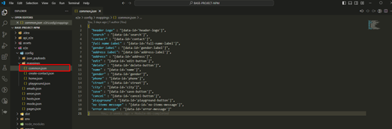

</details>
<br>

    B) create-contact.json:
This file focus specifically on elements related to creating a new contact.

**Purpose:**
To provide selectors for elements involved in the contact creation process, such as the header of the create contact form.

<details>
<summary>Click to open Create-contact.json image</summary>

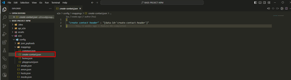

</details>
<br>

These selectors are going to be found in the create contact page:

<details>
<summary>Click to open Create-contact-web images</summary>


</details>
<br>

    C) home.json:
This file includes selectors relevant to the home page, for managing or displaying contacts inside the home page.

**Purpose:**
To define selectors for elements on the home page, such as headers, buttons for creating contacts, and fields for contact details. This helps in testing functionalities specific to the home view.

<details>
<summary>Click to open Home.json image</summary>

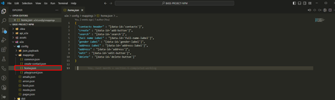

</details>
<br>

These selectors are going to be found in the Home page:

<details>
<summary>Click to open Home-web image</summary>


</details>
<br>

    D) playground.json:
This file contains a broader set of selectors, for a variety of UI components that may be used across multiple tests, such as radio buttons, input fields, alerts, and more, inside the page “playground”.

**Purpose:**
To provide a comprehensive set of selectors for various interactive elements within a playground environment.
It supports a range of test scenarios inside the playground page.

<details>
<summary>Click to open Playground.json image</summary>

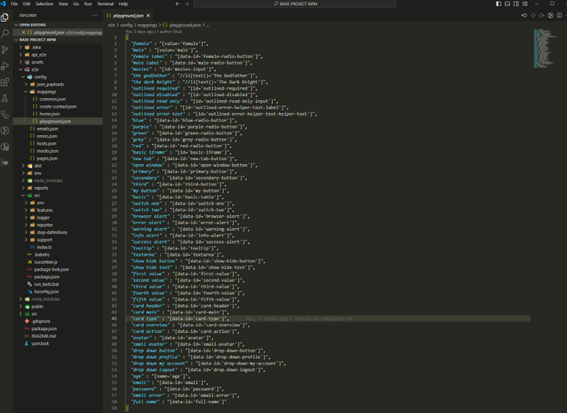

</details>
<br>

These selectors are going to be found in the Home page:

<details>
<summary>Click to open Playground-web images</summary>


</details>
<br>

**Observations:**

**Centralized Management:** By using these JSON files for mappings, the project allows for centralized management of selectors, which simplifies testing and reduces the risk of errors caused by changes in the UI.

**Readability:** The descriptive keys make it easy to understand what each selector corresponds to, improving the readability of test scripts.

#### 2 - e2e > Config > emails.json file:

This file contains email-related configurations, specifically for testing purposes (to be used ahead in our tests).

**Purpose:** It provides a designated email address to be used in tests, ensuring consistency and reliability in scenarios that require email interactions.

<details>
<summary>Click to open emails.json image</summary>

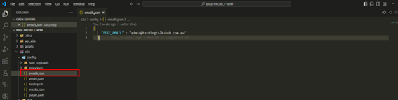

</details>
<br>

#### 3 - e2e > Config > errors.json file:

This file defines error messages to be used in the automation tests.

**Purpose:** It maps original error message patterns (using regex) to more user-friendly messages. This aids in debugging by making errors clearer and easier to understand during test failures.

<details>
<summary>Click to open errors.json image</summary>

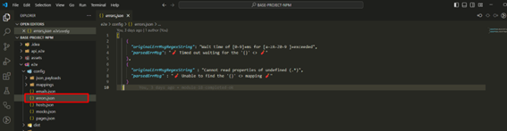

</details>
<br>

#### 4 - e2e > Config > hosts.json file:

This file defines different host URLs for various environments.

**Purpose:** It centralizes the URLs for different environments, enabling easy switching between local development and production environments, as well as providing an API endpoint for tests. (For now, ignore the api)

<details>
<summary>Click to open hosts.json image</summary>

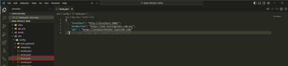

</details>
<br>

#### 5 - e2e > Config > mocks.json file:

This file is used for mocking data in tests.

**Purpose:** It specifies entities to be mocked during tests. In this case, its referring to a "users" object, which will be used to simulate user-related data in various scenarios.

<details>
<summary>Click to open mocks.json image</summary>

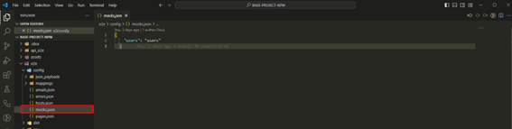

</details>
<br>

#### 6 - e2e > Config > pages.json file:

This file defines application routes and corresponding regex patterns for different pages.

**Purpose:** It helps in identifying the structure and navigation of the application. Each entry contains a route to navigate to and a regex to match the URL pattern, which will be useful for assertions in tests.

<details>
<summary>Click to open pages.json image</summary>

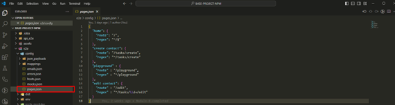

</details>
<br>

Ex:

Home page:

<details>
<summary>Click to open home-page-example image</summary>


</details>
<br>

Playground page:

<details>
<summary>Click to open playground-page-example image</summary>


</details>
<br>

[Back to Index](#index)

# END OF CONFIG FOLDER SECTION!!!

### e2e > .babelrc file:

Inside the e2e folder level, we have the following configuration file:

    .babelrc

File content:

```ts
{
    "presets": ["@babel/preset-typescript", "@babel/preset-env"]
}
```

<details>
<summary>Click to open .babelrc image</summary>

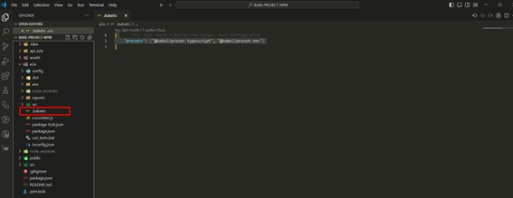

</details>
<br>

<details>
<summary>Click to open .babelrc file description</summary>
<br>

The .babelrc file is a configuration file for Babel, a JavaScript compiler that allows us to use the latest JavaScript features and TypeScript in our project. 

Here's a breakdown of the contents of our .babelrc file:

Explanation of the Presets:

1.	@babel/preset-typescript
o	This preset enables Babel to understand TypeScript syntax. It allows you  to write your code in TypeScript and compiles it down to plain JavaScript, which can be executed in environments that do not support TypeScript directly.
o	It primarily strips away TypeScript-specific features (like type annotations) but does not perform type-checking. For type-checking, you would still need to run the TypeScript compiler separately (using tsc).

2.	@babel/preset-env
o	This preset allows you to use the latest JavaScript features without worrying about which syntax transformations are needed for the environments you want to support (like older browsers).
o	It automatically determines the transformations and polyfills required based on your specified browser or environment support.

•	.babelrc file is essentially a JSON object that defines configuration settings for Babel. 
•	When you run Babel (for example, during a build process or when you transpile your code), Babel reads this configuration file to understand how to process your JavaScript and TypeScript files.

How It Works:

1.	Babel CLI/Build Tool Integration: When you invoke Babel (either through the command line or through a build tool like Webpack, Gulp, or others), it automatically looks for the .babelrc file in your project directory.

2.	Loading the Configuration: Babel reads the settings specified in the .babelrc file. In this case, it sees that it should use the @babel/preset-typescript and @babel/preset-env.

3.	Transpiling Code: Based on this configuration, Babel processes your code, transforming modern JavaScript and TypeScript syntax into a version that can be executed in the environments you want to support.

Example in Practice:

For example, if you have a TypeScript file that uses modern JavaScript features and type annotations, when you run Babel:

•	It will strip out the type annotations (due to @babel/preset-typescript).

•	It will also transform any modern JavaScript features (like arrow functions or async/await) into a format compatible with older browsers (thanks to @babel/preset-env).

</details>
<br>

### e2e > src > env folder:

The env folder contains the files:

- global.ts;
- parseEnv.ts.

The env folder serves as a hub for managing environmental configurations and shared types, ensuring that the automation framework or project has access to the right settings and utilities, regardless of the environment it's operating in.

    parseEnv.ts file:

File content:

```ts
export const getJsonFromFile = <T = Record<string, string>>(path: string): T => {
    return require(`${process.cwd()}${path}`);
};

export const env = (key: string): string => {
    const value = process.env[key]
    if (!value) {
        throw Error(`No environment variable found for ${key}`)
    }
    return value;
}

export const envNumber = (key: string): number => {
    return Number(env(key));
};
```
<details>
<summary>Click to open parsEnv.ts image</summary>

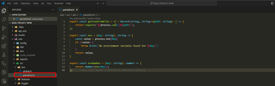

</details>
<br>

<details>
<summary>Click to open parseEnv.ts file description</summary>
<br>

1:
```ts
export const getJsonFromFile = <T = Record<string, string>>(path: string): T => {
```
***export const:*** This is declaring a constant function and exporting it, which means this function can be used in other files when they import it.

***getJsonFromFile:*** The name of the function. It retrieves and returns the contents of a JSON file.

***<T = Record<string, string>>:*** This is a generic type in TypeScript. It allows the function to return data of any specified type. If no specific type is provided when calling the function, it defaults to returning an object where the keys are strings and the values are strings (Record<string, string>).

***(path: string): T:*** This means the function takes one argument, path, which is a string representing the file path of the JSON file. The function returns data of type T (a generic type).

2: 
```ts
return require(`${process.cwd()}${path}`);
```

***require():*** This is a way to load external files (like JSON files). It is part of Node.js, which is commonly used in Playwright/TypeScript projects. Here, it's used to read the contents of the file at the given path.

***${process.cwd()}:*** This gets the current working directory (the folder where the project is running). cwd stands for "current working directory."

- Template literals (${}): The ${} syntax inside backticks (``) allows you to inject variables or expressions into a string.

- process.cwd() + ${path}: Combines the current working directory with the path provided to get the full path to the JSON file.

***Purpose:*** This line loads the JSON file located at the specified path and returns its contents.

3:
```ts
export const env = (key: string): string => {
```
***export const:*** This is declaring a constant function and exporting it, which means this function can be used in other files when they import it.

***env:*** This is the name of the function. It retrieves the value of an environment variable.

***(key: string):*** string: This means the function takes one argument, key, which is a string (the name of the environment variable). The function returns a string (the value of the environment variable).

4:
```ts
const value = process.env[key]
```

***process.env:*** This is a built-in object in Node.js that contains all the environment variables (key-value pairs) for the current running environment.

- Environment variables are used to store configuration values, like API keys, database URLs, or other settings, outside of your code.

***process.env[key]:*** This retrieves the value of the environment variable with the name key.

5:
```ts
if (!value) {
```

This checks if the value is undefined, null, or an empty string. If the value does not exist, the code inside the block will execute.

6: 
```ts
throw Error('No environment variable found for ${key}')
```

***throw Error():*** This creates a new error and stops the execution. If no value is found for the specified environment variable, this line throws an error with a custom message saying that the variable is missing.

***Purpose:*** To ensure that the environment variable exists, and if not, notify the user by throwing an error.

7:
```ts
return value;
```

If the environment variable exists, it returns the value. This allows other parts of the program to use the retrieved value.

8:
```ts
export const envNumber = (key: string): number => {
```

This defines another function called envNumber, which is similar to env but is specifically designed to return a number instead of a string.

***(key: string): number:*** It takes one argument, key (the name of the environment variable), and returns a number.

9:
```ts
return Number(env(key));
```

***env(key):*** This calls the env function defined earlier to get the value of the environment variable.

***Number():*** This converts the value returned by env(key) (which is a string) into a number. If the value cannot be converted to a valid number, it will return NaN (Not-a-Number).

***Purpose:*** This function is used when you expect an environment variable to be a numeric value (like width, height, port numbers, etc.).

***Summary:***

***getJsonFromFile:*** This function loads and returns the contents of a JSON file from the file system, making it easier to use external configurations.

***env:*** Retrieves a string value from environment variables, throwing an error if the variable is not found.

***envNumber:*** Retrieves a value from environment variables and converts it to a number, ensuring that numerical configurations (like screen size or timeout limits) are properly handled.

These functions are typically used in automation frameworks to handle configurations dynamically, allowing you to change settings (like screen sizes, API keys, etc.) without modifying the actual code.


</details>
<br>


