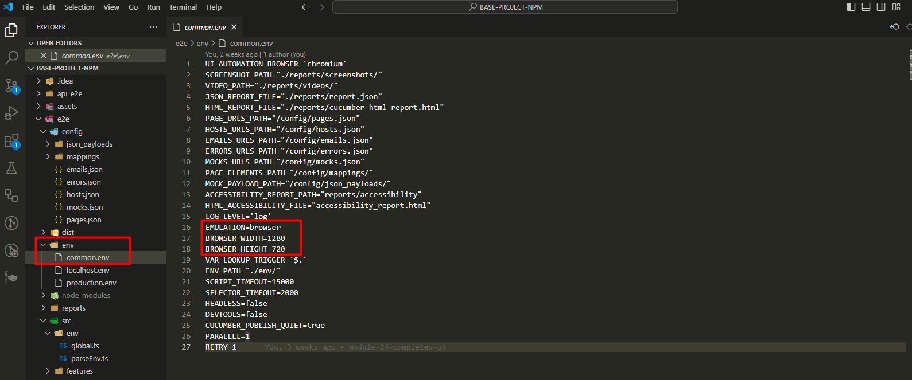

# Playwright + cucumber + typescript

<details>
<summary>Generic description of Playwright, cucumber and typescript</summary>
<br>

The purpose of this documentation is to explain how we can use an existing automation base structure, in any web automation project.
Its important to know that there are multiple ways of structuring a playwright + cucumber automation, and this is just one of them.


What is playwright: (put link to documentation)


What is cucumber:(put link to documentation)


What is typescript: (put link to documentation)

**Project Structure:**
<details>
  <summary>Click to open project structure images</summary>
  


  
</details>

For the purposes of this documentation tutorial, we will be using a test website:

(https://hub.testingtalks.com.au/ )

<details>
  <summary>Click to open testing website image</summary>


</details>

</details>
<br>


<a name="index"></a>

## Index
1. [Installation](#installation)

    1.1 [VisualStudioCodeSettings](#visual-studio-code-settings)

2. [e2e-Folder-Level](#folders-and-files-explanation)

    2.1 [Config-Folder](#e2e--config-folder)
    - [Mapings-folder](#e2e--config--mappings-folder)
      - [Common.json](#common-json)
      - [Create-Contact.json](#create-contact-json)
      - [Home.json](#home-json)
      - [Playground.json](#playground-json)

    - [Emails.json](#e2e--config--emails-json-file)
    - [Errors.json](#e2e--config--errors-json-file)
    - [Hosts.json](#e2e--config--hosts-json-file)
    - [Mocks.json](#e2e--config--mocks-json-file)
    - [Pages.json](#e2e--config--pages-json-file)

    2.2 [Env-Folder](#e2e--src--env-folder)
      - [ParsEnv.ts](#parsenv-ts-file)
      - [Global.ts](#global-ts-file)

    2.3 [SRC-Folder](#e2e--src-folder)
      - [Step-Definitions-Folder](#e2e--src--step-definitions-folder)
        - [Setup-Folder](#e2e--src--step-definitions--setup-folder)
          - [World.ts](#world-ts-file)
      - [Support-Folder](#e2e--src--support-folder)
        - [Browser-behavior.ts](#browser-behavior-ts-file)
        - [Error-helper.ts](#error-helper-ts-file)


          


## Installation

Save the project:

Save the project folder “BASE-PROJECT-NPM” in the local disk of your computer and rename it if necessary.


Install Node JS recomended version - (https://nodejs.org/en/download/)

Install Visual Studio Code - (https://code.visualstudio.com)

Open Visual Studio Code:

<details>
<summary>Click to open Visual Studio image</summary>


</details>
<br>

Go to Extensions and install the Cucumber (Gherkin) Full Support:

<details>
<summary>Click to open Cucumber extension image</summary>


</details>
<br>
 
The following dependencies are already created in the Package.json file:

```ts
{
  "name": "e2e",
  "version": "1.0.0",
  "description": "",
  "main": "index.js",
  "scripts": {
    "precucumber": "rimraf reports && mkdir reports && echo {} > reports/report.json",
    "transpile": "rimraf dist && babel --extensions .ts --out-dir dist src",
    "cucumber": "npm run transpile && cucumber-js",
    "cucumber:localhost": "npm run transpile && cucumber-js",
    "cucumber:production": "npm run transpile && cucumber-js",
    "postcucumber": "cross-env COMMON_CONFIG_FILE=env/common.env ts-node ./src/reporter/cucumber-report.ts"
  },
  "author": "",
  "license": "ISC",
  "devDependencies": {
    "@babel/cli": "^7.25.6",
    "@babel/core": "^7.25.2",
    "@babel/preset-env": "^7.25.4",
    "@babel/preset-react": "^7.24.7",
    "@babel/preset-typescript": "^7.24.7",
    "@cucumber/cucumber": "^10.9.0",
    "@playwright/test": "^1.46.1",
    "@types/body-parser": "^1.19.5",
    "@types/cucumber-html-reporter": "^5.0.1",
    "@types/faker": "^5.5.3",
    "@types/node": "^22.5.1",
    "axe-html-reporter": "^2.2.11",
    "axe-playwright": "^2.0.3",
    "cross-env": "^7.0.3",
    "dotenv": "^16.4.5",
    "faker": "^5.5.3",
    "playwright": "^1.46.1",
    "rimraf": "^6.0.1",
    "ts-node": "^10.9.2",
    "typescript": "^5.5.4"
  },
  "dependencies": {
    "cucumber-html-reporter": "^7.1.1"
  }
}
```
 
These are all the dependencies that we need in the framework structure, to create and execute the test cases and the reports.

Open the Terminal in VS Code:

<details>
<summary>Click to open Terminal access image</summary>


</details>
<br>
 
 The terminal is opened:

<details>
<summary>Click to open Terminal image</summary>


</details>
<br>
 
Navigate to the e2e folder, which is where our end to end project structure is created.

To do this, type “cd e2e” and enter.

The route is now pointing to the e2e folder:

<details>
<summary>Click to open Route image</summary>


</details>
<br>
 
The dependencies are already in the package.json file, however, they are not installed yet. 

Install the dependencies by writing the following command in the terminal:

To do this, run the command: **npm install** and click **enter**

All the dependencies are now installed.

The project structure inside the e2e folder, looks like this:

<details>
<summary>Click to open Project Structure image</summary>


</details>
<br>

## Visual Studio Code settings

Configure the Visual Studio settings.json file, so the cucumber features and the cucumber glue are pointing correctly to our Test Cases features folder and Step definitions.

**Note: Without this configuration, it will not be possible to execute the test cases.**

•	Click CTRL + , to open the settings:
 
<details>
<summary>Click to open Cucumber Settings image</summary>


</details>
<br>
  
•	Search for cucumber:
 
<details>
<summary>Click to open Cucumber Search image</summary>


</details>
<br>
 
•	Click in "Editing settings" and define where the feature file is, in Cucumber.Features:

<details>
<summary>Click to open Edit Settings image</summary>


</details>
<br>
  
•	Define where the steps file is in cucumber features and in cucumber.features:


``` ts
"e2e/src/features/*.feature"],
```
<details>
<summary>Click to open Cucumber Feature image</summary>


</details>
<br>
 
•	Define where the steps definitions file is, in cucumber.glue:

``` ts
"e2e/src/step-definitions/*.ts",
"e2e/src/step-definitions/assertions/*.ts"
```
<details>
<summary>Click to open Cucumber Glue image</summary>


</details>
<br>

### The installation and visual studio configurations are completed.

[Back to Index](#index)


## FOLDERS AND FILES EXPLANATION:

## e2e \> Config folder:

The config folder holds various configuration files that are used to define and manage the behavior, settings, and environment parameters for our test automation project, and it contains:

#### e2e \> Config \> Mappings folder:

* Inside the Config folder, we have the Mappings folder, which contains configuration files that map different components, data, or behavior of our automation framework.

**Files of the Mappings folder:**

#### Common json:

File content:

```ts
{
  "header logo" : "[data-id='header-logo']",
  "search" : "[data-id='search']",
  "contact" : "[data-id='contact']",
  "full name label" : "[data-id='full-name-label']",
  "gender label" : "[data-id='gender-label']",
  "address label": "[data-id='address-label']",
  "address" : "[data-id='address']",
  "edit" : "[data-id='edit-button']",
  "delete" : "[data-id='delete-button']",
  "name" : "[data-id='name']",
  "gender" : "[data-id='gender']",
  "phone" : "[data-id='phone']",
  "street" : "[data-id='street']",
  "city" : "[data-id='city']",
  "save" : "[data-id='save-button']",
  "cancel" : "[data-id='cancel-button']",
  "playground" : "[data-id='playground-button']",
  "no items message" : "[data-id='no-items-message']",
  "error message" : "[data-id='error-message']"
}
```

This file contains mappings of various UI elements to their corresponding selectors. It provides a centralized way to reference elements across different tests and different pages on the website, thus the name “common”. 

Each key is a descriptive label, and each value is a CSS selector (or other selector type) that identifies the corresponding element on the web page.

**Purpose:**
To simplify and standardize the way UI elements are accessed in tests.
Facilitates easier maintenance, as changes to selectors only need to be updated in one place.


#### Create Contact json:

File content:

```ts
{
  "create contact header" : "[data-id='create-contact-header']"
}
```

This file focus specifically on elements related to creating a new contact.

**Purpose:**
To provide selectors for elements involved in the contact creation process, such as the header of the create contact form.


These selectors are going to be found in the create contact page:

<details>
<summary>Click to open Create-contact-web images</summary>


</details>
<br>

#### Home json:

File content:

```ts
{
  "contacts header" : "[data-id='contacts']",
  "create" : "[data-id='add-button']",
  "search" : "[data-id='search']",
  "full name label" : "[data-id='full-name-label']",
  "gender label" : "[data-id='gender-label']",
  "address label" : "[data-id='address-label']",
  "address" : "[data-id='address']",
  "edit" : "[data-id='edit-button']",
  "delete" : "[data-id='delete-button']"
}
```

This file includes selectors relevant to the home page, for managing or displaying contacts inside the home page.

**Purpose:**
To define selectors for elements on the home page, such as headers, buttons for creating contacts, and fields for contact details. This helps in testing functionalities specific to the home view.


These selectors are going to be found in the Home page:

<details>
<summary>Click to open Home-web image</summary>


</details>
<br>

#### Playground json:

File content:

```Ts
{
  "female" : "[value='female']",
  "male" : "[value='male']",
  "female label" : "[data-id='female-radio-button']",
  "male label" : "[data-id='male-radio-button']",
  "movies" : "[id='movies-input']",
  "the godfather" : "//li[text()='The Godfather']",
  "the dark knight" : "//li[text()='The Dark Knight']",
  "outlined required" : "[id='outlined-required']",
  "outlined disabled" : "[id='outlined-disabled']",
  "outlined read only" : "[id='outlined-read-only-input']",
  "outlined error" : "[id='outlined-error-helper-text-label']",
  "outlined error text" : "[id='outlined-error-helper-text-helper-text']",
  "blue" : "[data-id='blue-radio-button']",
  "purple" : "[data-id='purple-radio-button']",
  "green" : "[data-id='green-radio-button']",
  "grey" : "[data-id='grey-radio-button']",
  "red" : "[data-id='red-radio-button']",
  "basic iframe" : "[id='basic-iframe']",
  "new tab" : "[data-id='new-tab-button']",
  "open window" : "[data-id='open-window-button']",
  "primary" : "[data-id='primary-button']",
  "secondary" : "[data-id='secondary-button']",
  "third" : "[data-id='third-button']",
  "my button" : "[data-id='my-button']",
  "basic" : "[data-id='basic-table']",
  "switch one" : "[data-id='switch-one']",
  "switch two" : "[data-id='switch-two']",
  "browser alert" : "[data-id='browser-alert']",
  "error alert" : "[data-id='error-alert']",
  "warning alert" : "[data-id='warning-alert']",
  "info alert" : "[data-id='info-alert']",
  "success alert" : "[data-id='success-alert']",
  "tooltip" : "[data-id='tooltip']",
  "textarea" : "[data-id='textarea']",
  "show hide button" : "[data-id='show-hide-button']",
  "show hide text" : "[data-id='show-hide-text']",
  "first value" : "[data-id='first-value']",
  "second value" : "[data-id='second-value']",
  "third value" : "[data-id='third-value']",
  "fourth value" : "[data-id='fourth-value']",
  "fifth value" : "[data-id='fifth-value']",
  "card header" : "[data-id='card-header']",
  "card main" : "[data-id='card-main']",
  "card type" : "[data-id='card-type']",
  "card overview" : "[data-id='card-overview']",
  "card action" : "[data-id='card-action']",
  "avatar" : "[data-id='avatar']",
  "small avatar" : "[data-id='small-avatar']",
  "drop down button" : "[data-id='drop-down-button']",
  "drop down profile" : "[data-id='drop-down-profile']",
  "drop down my account" : "[data-id='drop-down-my-account']",
  "drop down logout" : "[data-id='drop-down-logout']",
  "age" : "[name='age']",
  "email" : "[data-id='email']",
  "password" : "[data-id='password']",
  "email error" : "[data-id='email-error']",
  "full name" : "[data-id='full-name']"
}
```

This file contains a broader set of selectors, for a variety of UI components that may be used across multiple tests, such as radio buttons, input fields, alerts, and more, inside the page “playground”.

**Purpose:**
To provide a comprehensive set of selectors for various interactive elements within a playground environment.
It supports a range of test scenarios inside the playground page.

These selectors are going to be found in the playground page:

<details>
<summary>Click to open Playground-web images</summary>


</details>
<br>

**Observations:**

**Centralized Management:** By using these JSON files for mappings, the project allows for centralized management of selectors, which simplifies testing and reduces the risk of errors caused by changes in the UI.

**Readability:** The descriptive keys make it easy to understand what each selector corresponds to, improving the readability of test scripts.

#### e2e \> Config \> Emails json file:

File content:

```Ts
{
    "TEST_EMAIL" : "admin@testingtalkshub.com.au"
  }
```

This file contains email-related configurations, specifically for testing purposes (to be used ahead in our tests).

**Purpose:** It provides a designated email address to be used in tests, ensuring consistency and reliability in scenarios that require email interactions.


#### e2e \> Config \> Errors json file:

File content:

```ts
[
    {
      "originalErrMsgRegexString": "Wait time of [0-9]+ms for [a-zA-Z0-9 ]+exceeded",
      "parsedErrMsg": "🧨 Timed out waiting for the '{}' <> 🧨"
    },
    {
      "originalErrMsgRegexString" : "Cannot read properties of undefined (.*)",
      "parsedErrMsg" : "🧨 Unable to find the '{}' <> mapping 🧨"
    }
  ]
```

This file defines error messages to be used in the automation tests.

**Purpose:** It maps original error message patterns (using regex) to more user-friendly messages. This aids in debugging by making errors clearer and easier to understand during test failures.


#### e2e \> Config \> Hosts json file:

File content:

```ts
{
    "localhost": "http://localhost:3000/",
    "production": "https://hub.testingtalks.com.au/",
    "api" : "https://jsonplaceholder.typicode.com/"
  }
```

This file defines different host URLs for various environments.

**Purpose:** It centralizes the URLs for different environments, enabling easy switching between local development and production environments, as well as providing an API endpoint for tests. (For now, ignore the api)

#### e2e \> Config \> Mocks json file:

File content:

```Ts
{
    "users": "users"
  }
```

This file is used for mocking data in tests.

**Purpose:** It specifies entities to be mocked during tests. In this case, its referring to a "users" object, which will be used to simulate user-related data in various scenarios.

#### e2e \> Config \> Pages json file:

File content:

```ts
{
  "home": {
    "route": "/",
    "regex": "^/$"
  },
  "create contact": {
    "route": "/tasks/create",
    "regex": "^/tasks/create"
  },
  "playground" : {
    "route" : "/playground",
    "regex" : "^/playground"
  },
  "edit contact": {
    "route" : "/edit",
    "regex" : "^/tasks/\\d+/edit"
  }
}
```

This file defines application routes and corresponding regex patterns for different pages.

**Purpose:** It helps in identifying the structure and navigation of the application. Each entry contains a route to navigate to and a regex to match the URL pattern, which will be useful for assertions in tests.

Ex:

Home page:

<details>
<summary>Click to open home-page-example image</summary>


</details>
<br>

Playground page:

<details>
<summary>Click to open playground-page-example image</summary>


</details>
<br>

[Back to Index](#index)


### e2e \> src \> env folder:

The env folder contains the files:

- global.ts;
- parseEnv.ts.

The env folder serves as a hub for managing environmental configurations and shared types, ensuring that the automation framework or project has access to the right settings and utilities, regardless of the environment it's operating in.

#### parsEnv ts file:

File content:

This file is focused on retrieving environment variables and reading JSON data from files. It has two main functionalities: 

- Accessing environment variables;
- Handling file-based JSON data. 

```ts
export const getJsonFromFile = <T = Record<string, string>>(path: string): T => {
    return require(`${process.cwd()}${path}`);
};

export const env = (key: string): string => {
    const value = process.env[key]
    if (!value) {
        throw Error(`No environment variable found for ${key}`)
    }
    return value;
}

export const envNumber = (key: string): number => {
    return Number(env(key));
};
```

<details>
<summary>Click to open parseEnv.ts code description</summary>
<br>

1:
```ts
export const getJsonFromFile = <T = Record<string, string>>(path: string): T => {
```
***export const:*** This is declaring a constant function and exporting it, which means this function can be used in other files when they import it.

***getJsonFromFile:*** The name of the function. It retrieves and returns the contents of a JSON file.

***<T = Record<string, string>>:*** This is a generic type in TypeScript. It allows the function to return data of any specified type. If no specific type is provided when calling the function, it defaults to returning an object where the keys are strings and the values are strings (Record<string, string>).

***(path: string): T:*** This means the function takes one argument, path, which is a string representing the file path of the JSON file. The function returns data of type T (a generic type).

2: 
```ts
return require(`${process.cwd()}${path}`);
```

***require():*** This is a way to load external files (like JSON files). It is part of Node.js, which is commonly used in Playwright/TypeScript projects. Here, it's used to read the contents of the file at the given path.

***${process.cwd()}:*** This gets the current working directory (the folder where the project is running). cwd stands for "current working directory."

- Template literals (${}): The ${} syntax inside backticks (``) allows you to inject variables or expressions into a string.

- process.cwd() + ${path}: Combines the current working directory with the path provided to get the full path to the JSON file.

***Purpose:*** This line loads the JSON file located at the specified path and returns its contents.

3:
```ts
export const env = (key: string): string => {
```
***export const:*** This is declaring a constant function and exporting it, which means this function can be used in other files when they import it.

***env:*** This is the name of the function. It retrieves the value of an environment variable.

***(key: string):*** string: This means the function takes one argument, key, which is a string (the name of the environment variable). The function returns a string (the value of the environment variable).

4:
```ts
const value = process.env[key]
```

***process.env:*** This is a built-in object in Node.js that contains all the environment variables (key-value pairs) for the current running environment.

- Environment variables are used to store configuration values, like API keys, database URLs, or other settings, outside of your code.

***process.env[key]:*** This retrieves the value of the environment variable with the name key.

5:
```ts
if (!value) {
```

This checks if the value is undefined, null, or an empty string. If the value does not exist, the code inside the block will execute.

6: 
```ts
throw Error('No environment variable found for ${key}')
```

***throw Error():*** This creates a new error and stops the execution. If no value is found for the specified environment variable, this line throws an error with a custom message saying that the variable is missing.

***Purpose:*** To ensure that the environment variable exists, and if not, notify the user by throwing an error.

7:
```ts
return value;
```

If the environment variable exists, it returns the value. This allows other parts of the program to use the retrieved value.

8:
```ts
export const envNumber = (key: string): number => {
```

This defines another function called envNumber, which is similar to env but is specifically designed to return a number instead of a string.

***(key: string): number:*** It takes one argument, key (the name of the environment variable), and returns a number.

9:
```ts
return Number(env(key));
```

***env(key):*** This calls the env function defined earlier to get the value of the environment variable.

***Number():*** This converts the value returned by env(key) (which is a string) into a number. If the value cannot be converted to a valid number, it will return NaN (Not-a-Number).

***Purpose:*** This function is used when you expect an environment variable to be a numeric value (like width, height, port numbers, etc.).

***Summary:***

***getJsonFromFile:*** This function loads and returns the contents of a JSON file from the file system, making it easier to use external configurations.

***env:*** Retrieves a string value from environment variables, throwing an error if the variable is not found.

***envNumber:*** Retrieves a value from environment variables and converts it to a number, ensuring that numerical configurations (like screen size or timeout limits) are properly handled.

These functions are typically used in automation frameworks to handle configurations dynamically, allowing you to change settings (like screen sizes, API keys, etc.) without modifying the actual code.


</details>
<br>

#### Global ts file:

This file defines a set of types and interfaces that are used across the entire project to ensure consistency, especially when dealing with configurations, error handling, and page elements in our automation framework.
It's like a blueprint that specifies what data is available, how it’s structured, and what kind of operations are allowed on it.

The primary purpose of this file is to:

- Define global types for managing different parts of our automation framework.
- Ensure type safety when dealing with configurations, mappings, and errors.
- Create reusable structures to avoid duplication across the project.
- Standardize the handling of mock data, page elements, and configurations.

File content:

```ts
export type PageId = string
export type ElementKey = string
export type ElementLocator = string
export type WaitForTargetType = string
export type MockConfigKey = string
export type MockServerKey = string
export type MockPayloadKey = string
export type WaitForTarget = PageId | ElementKey
export type PageElementMappings = Record<PageId, Record<ElementKey, ElementLocator>>
export type MockPayloadMappings = Record<string, string>
export type PagesConfig = Record<PageId, Record<string, string>>
export type HostsConfig = Record<string, string>
export type ErrorsConfig = ErrorConfig[]
export type MocksConfig = Record<string, string>
export type GlobalVariables = { [key: string]: string }
export type EmailsConfig = Record<string, string>

export type ErrorConfig = {
    originalErrMsgRegexString: string
    parsedErrMsg: string
}

export type GlobalConfig = {
    pageElementMappings: PageElementMappings
    mockPayloadMappings: MockPayloadMappings
    hostsConfig: HostsConfig
    pagesConfig: PagesConfig
    errorsConfig: ErrorsConfig
    emailsConfig: EmailsConfig
    mocksConfig: MocksConfig
};
```

<details>
<summary>Click to open global.ts code description</summary>
<br>

1. Basic Type Aliases

*A type alias in TypeScript is a way to give a name to a type. This helps make the code easier to read and maintain. Think of it like creating shortcuts for certain types of data that will be used frequently.*

```ts
export type PageId = string
export type ElementKey = string
export type ElementLocator = string
export type WaitForTargetType = string
export type MockConfigKey = string
export type MockServerKey = string
export type MockPayloadKey = string
export type WaitForTarget = PageId | ElementKey
```

- PageId, ElementKey, ElementLocator: These define specific types for page IDs, element keys, and locators within our automation framework.

- WaitForTarget: This type allows us to wait for either a PageId or ElementKey—useful for targeting specific elements or pages.

- MockConfigKey, MockServerKey, MockPayloadKey: These are related to mock data handling, assigning string types for keys used in mock configurations and servers.

What does this mean?

PageId:

PageId is just another name for string.
It represents the ID of a page in our application. For example, the homepage might have an ID like "HomePage".
By creating this alias, we make it clear that when we use PageId, we're referring specifically to a page’s identifier.

ElementKey:

Also a string, but this refers to the name or key for an element on a webpage, such as a button, a text box, or a link.
For instance, the key for a login button might be "loginButton".

ElementLocator:

This is a string that represents the location of an element on a page.
It's typically a CSS selector or XPath used by automation tools like Playwright to interact with that element. 

Example: "#loginButton" could be the locator for a button with the ID loginButton.

WaitForTarget:

This type says that a WaitForTarget can be either a PageId or an ElementKey.
This means in our code, when we want to wait for something (like a page or an element to load), we can use either a page ID or an element key.

2. Mappings and Configuration Types

```ts
export type PageElementMappings = Record<PageId, Record<ElementKey, ElementLocator>>
export type MockPayloadMappings = Record<string, string>
export type PagesConfig = Record<PageId, Record<string, string>>
export type HostsConfig = Record<string, string>
export type ErrorsConfig = ErrorConfig[]
export type MocksConfig = Record<string, string>
export type GlobalVariables = { [key: string]: string }
export type EmailsConfig = Record<string, string>

```

- PageElementMappings: Defines a structure for mapping page elements. It's a dictionary where each PageId contains a dictionary of ElementKey-to-ElementLocator mappings. 
This is used to store and retrieve the locators for elements on different pages.

**What does this mean?**

Record<PageId, Record<ElementKey, ElementLocator>>: This is a mapping or dictionary. Think of it like a table that connects pages, elements, and their locators.

Here’s how it works:

The outer Record<PageId, Record<ElementKey, ElementLocator>> is saying: “I have a list of pages, and for each page, I have a list of elements and their locators.”
Inside each page (identified by PageId), there’s another dictionary (Record<ElementKey, ElementLocator>) that maps each element (identified by ElementKey) to a locator (ElementLocator).

- MockPayloadMappings: A dictionary for storing mock payloads, used when mocking server responses.

This defines a mapping between some kind of identifier and a piece of mock data. It’s used when we want to simulate server responses in tests without hitting the actual server.

- PagesConfig: Stores configuration for each page, where the key is PageId and the value is a set of key-value pairs (often used for custom page settings).

- HostsConfig: Maps different hostnames or URLs for different environments (e.g., dev, test, production).

- ErrorsConfig: A list of ErrorConfig objects, used to define and handle specific error configurations (see the ErrorConfig section below).

- MocksConfig: A dictionary of mock data configurations, which could be used to set up fake data responses for tests.

- GlobalVariables: A key-value pair object where both keys and values are strings, used to store global variables in your project.

- EmailsConfig: This might store email addresses or other email-related configurations.

3. Error Handling Configuration

```ts
export type ErrorConfig = {
    originalErrMsgRegexString: string
    parsedErrMsg: string
}

```

- ErrorConfig: Defines a structure for error handling. It includes:
    - originalErrMsgRegexString: A regex pattern to match specific error messages.

    - parsedErrMsg: The parsed or more user-friendly version of the error message.

This can be used to catch, parse, and reformat errors during our automation testing.

4. Global Configuration

```ts
export type GlobalConfig = {
    pageElementMappings: PageElementMappings
    mockPayloadMappings: MockPayloadMappings
    hostsConfig: HostsConfig
    pagesConfig: PagesConfig
    errorsConfig: ErrorsConfig
    emailsConfig: EmailsConfig
    mocksConfig: MocksConfig
};

```
GlobalConfig: This is a central structure that ties all of the other configurations together. It holds all the different mappings and configurations we need in one place.

- Page Element Mapping: This allows us to map specific page elements (like buttons, text fields, etc.) to locators dynamically. This is useful for managing locators in a single place rather than hardcoding them in each test.
**Note:** pageElementMappings is a variable or property, and it is expected to follow the type alias PageElementMappings.

- Mock Data Handling: The mock payload mappings and configuration are used to mock API responses or server behavior during tests, ensuring that we can test without relying on actual server responses.

- Error Handling: The error configuration provides a way to capture specific error patterns and convert them into more meaningful error messages, improving test reporting and debugging.

- Global Settings: GlobalConfig consolidates all the configurations so that our tests have easy access to the necessary information without scattering it across different files.


**Summary:**

- Type Aliases: Help define the kinds of data you’re working with, such as page IDs, element locators, or mock payloads.
- Mappings: Create connections between different pieces of data, such as page elements and their locators or mock requests and their responses.
- Configurations: Provide settings and error-handling rules for your automation framework, making it easier to maintain and scale your project.

**Conclusion:**

- **Consistency:** The types defined here allow us to manage page elements, error handling, mock data, and configuration in a consistent way throughout the project.

- **Flexibility:** The use of Record<string, string> types allows for flexibility in how we map data and configurations.

- **Centralized Configuration:** By using GlobalConfig, we keep all the critical settings and mappings in one place, making it easier to manage and modify over time.


</details>
<br>

[Back to Index](#index)


### e2e \> src folder

The src (short for "source") folder is a common convention in software development, especially in projects using languages like JavaScript, TypeScript, or similar. 

#### Purpose of the src Folder

- **Organize Source Code:**

The src folder serves as the main directory for all the source code files of our application or library. It helps keep the project organized by separating source code from configuration files, documentation, and other resources.

- **Modular Structure:**

Inside the src folder, we create subfolders to further organize our code by features, components, or modules, making it easier to navigate and maintain.

- **Easier Build Process:**

Many build tools and bundlers (like Webpack, Rollup, or Parcel) expect the source code to reside in a src folder. This makes it straightforward to specify which files should be compiled or bundled when preparing the application for production.

- **Code Clarity:**

Having a dedicated src folder enhances code clarity by indicating which files are part of the application's logic as opposed to files that are generated, built, or serve a different purpose (like dist for distribution).

#### e2e \> src \> step-definitions folder

The step-definitions folder in our project is used to store the step definition files for behavior-driven development (BDD) tests.

**Purpose of the step-definitions Folder:**

- **Linking Feature Files to Test Code:**

In BDD, feature files describe the behavior of our application in plain language using the Gherkin syntax (e.g., Given, When, Then). The step definitions provide the actual implementation for these steps. This folder contains those implementations.

- **Maintain Code Separation:**

The folder separates the high-level, human-readable feature files from the actual test logic. Each step in a feature file corresponds to a function in a step definition file.

- **Reusable Test Steps:**

Step definitions allow us to reuse the same code for similar steps across multiple feature files, promoting DRY (Don't Repeat Yourself) principles.

- **Organization:**

By organizing our step definitions in this folder, we can easily manage and locate the code that executes the test cases for each feature. The step definitions are grouped by feature or functionality to keep everything organized.

### e2e \> src \> step-definitions \> setup folder:

The setup folder in our project is used to configure and prepare the environment for our Cucumber tests. 

The setup folder contains the file:

#### World ts file:

File content:

This file acts as the bridge between our BDD tests (written in Cucumber) and the browser automation tool (Playwright), providing the necessary setup, configuration, and browser management for our tests to run smoothly.

```ts
import playwright, {
    BrowserContextOptions,
    Page,
    Browser,
    BrowserContext,
    BrowserType
} from "playwright";
import { env } from '../../env/parseEnv'
import { World, IWorldOptions, setWorldConstructor} from "@cucumber/cucumber";
import { GlobalConfig, GlobalVariables } from '../../env/global';

export type Screen = {
    browser: Browser;
    context: BrowserContext;
    page: Page;
}

export class ScenarioWorld extends World {
    constructor(options: IWorldOptions) {
        super(options)

        this.globalConfig = options.parameters as GlobalConfig;
        this.globalVariables = {};
    }

    globalConfig: GlobalConfig;

    globalVariables: GlobalVariables;

    screen!: Screen;

    async init(contextOptions?: BrowserContextOptions): Promise<Screen> {
        await this.screen?.page?.close();
        await this.screen?.context?.close()
        await this.screen?.browser?.close()

        const browser = await this.newBrowser();
        const context = await browser.newContext(contextOptions)
        const page = await context.newPage();

        this.screen = { browser, context, page };

        return this.screen
    }

    private newBrowser = async (): Promise<Browser> => {

        const automationBrowsers = ['chromium', 'firefox', 'webkit']
        type AutomationBrowser = typeof automationBrowsers[number]
        const automationBrowser = env('UI_AUTOMATION_BROWSER') as AutomationBrowser

        const browserType: BrowserType = playwright[automationBrowser];
        const browser = await browserType.launch({
            devtools: process.env.DEVTOOLS !== 'false',
            headless: process.env.HEADLESS !== 'false',
            args: ['--disable-web-security', '--disable-features=IsolateOrigins, site-per-process'],
        })
        return browser;
    }

}

setWorldConstructor(ScenarioWorld)
```

<details>
<summary>Click to open world.ts code description</summary>
<br>

Imports:
```ts
import playwright, {
    BrowserContextOptions,
    Page,
    Browser,
    BrowserContext,
    BrowserType
} from "playwright";
import { env } from '../../env/parseEnv'
import { World, IWorldOptions, setWorldConstructor} from "@cucumber/cucumber";
import { GlobalConfig, GlobalVariables } from '../../env/global';

```

- import playwright {...}: This imports playwright and some of its types. Playwright is a Node.js library that allows us to automate browser interactions. These types (Browser, Page, etc.) are used to control the browser and its contexts (tabs, cookies, sessions).

- env: This is a custom function from our parseEnv.ts file, used to read environment variables (like configurations).

- World, IWorldOptions, setWorldConstructor: These are imported from Cucumber. Cucumber is a tool used for Behavior-Driven Development (BDD). It allows writing tests in plain English (Gherkin syntax), and World is a class that provides context for each scenario. setWorldConstructor allows customizing the World.

- GlobalConfig, GlobalVariables: These are types imported from our global.ts file. GlobalConfig holds various configurations, and GlobalVariables holds global variables (for storing data during the test session).

**Type Definitions:**
```ts
export type Screen = {
    browser: Browser;
    context: BrowserContext;
    page: Page;
}
```
- Screen: This is a TypeScript type alias that defines a structure containing:
    - browser: This is an instance of a browser.
    - context: This is the browser's context, which represents an isolated environment (like a tab) within the browser.
    - page: This represents the web page that the browser opens and interacts with.

**The ScenarioWorld class:**
```ts
export class ScenarioWorld extends World {
    constructor(options: IWorldOptions) {
        super(options)
        this.globalConfig = options.parameters as GlobalConfig;
        this.globalVariables = {};
    }

    globalConfig: GlobalConfig;
    globalVariables: GlobalVariables;
    screen!: Screen;
```

- ScenarioWorld class: This extends the World class from Cucumber. It customizes what happens in each scenario, storing configurations and variables needed for the tests.

**Context:** Class Inheritance in TypeScript (or JavaScript)
In object-oriented programming (OOP), inheritance allows a class to inherit properties and methods from another class. This is useful because it lets us reuse code and create specialized versions of generic classes.

When you create a class in TypeScript or JavaScript using the class keyword, you can extend (inherit from) another class using the extends keyword. When a class inherits from another class, the parent class is often referred to as the "superclass" and the child class as the "subclass."

In our case, ScenarioWorld is a subclass, and it inherits from the World class provided by the @cucumber/cucumber library.

- constructor(options: IWorldOptions): The constructor gets called when a new instance of ScenarioWorld is created for each scenario.


_The constructor is a special method in classes that gets called when we create a new instance of the class. It’s where you set up the initial state of an object._

_It is called automatically when an instance (or object) of a class is created. It allows us to initialize properties or execute any setup code we need when the object is instantiated. In TypeScript, constructors are often used to initialize variables or objects and pass in any necessary configurations or data._

_In the context of the ScenarioWorld class, the constructor is used to initialize the test's environment. It sets up the necessary configurations and prepares the class for running the test scenario._

_Parent Class (World)_
_The World class in Cucumber is the base class that gives access to shared data or context for all steps in a test scenario. This class might include properties and methods to help manage data during the test execution._

_When we extend the World class to create our ScenarioWorld class, we want to make sure that the base functionality provided by World is still available in our custom class._

- super(options): This calls the parent World class's constructor to inherit its properties.

**super(options): Why It’s Needed:**
The super() function in the constructor is necessary when our class extends another class. It ensures that the parent class's constructor gets called so that the inherited properties and methods are correctly set up. Without this call to super(), the child class (ScenarioWorld in this case) wouldn't properly inherit the initialization logic of the parent class (World).

**What does super(options) do here?**
***In our case:***

```ts
constructor(options: IWorldOptions) {
    super(options)
    this.globalConfig = options.parameters as GlobalConfig;
    this.globalVariables = {};
}
```

- constructor(options: IWorldOptions): This defines the constructor of the ScenarioWorld class. It takes in a parameter options of type IWorldOptions.
- super(options): This line calls the constructor of the World class (the parent class) and passes the options parameter to it.
This ensures that the World class can do its necessary setup with the options object.
It might initialize certain properties or prepare internal logic for Cucumber to work correctly.
Without calling super(options), our ScenarioWorld class wouldn’t have access to any of the properties and methods that World provides.

Example to Illustrate super() in Simple Terms
Here’s a simplified analogy of what’s happening:

_Imagine the World class is like a blueprint for building a generic test environment. It has some predefined settings and tools (like a shared context, or scenario data).
You create your own specialized blueprint, ScenarioWorld, but you still want to use the tools and settings from the original World blueprint.
By calling super(), you are saying, "Hey, use the parent blueprint first to set everything up, and then I’ll add my customizations afterward."
Practical Usage in Your ScenarioWorld
In Cucumber, the World class provides a test context that is shared between the different steps of a scenario. By inheriting from it, your ScenarioWorld gains access to that shared context, but you can also add your own custom logic and properties (like globalConfig and globalVariables)._

**Full Breakdown of our constructor:**

```ts
constructor(options: IWorldOptions) {
    super(options)  // Calls the constructor of the parent class (World) to set up inherited functionality.
    
    // Custom properties for the ScenarioWorld
    this.globalConfig = options.parameters as GlobalConfig;  // Stores test configurations in a typed variable
    this.globalVariables = {};  // Initializes an empty object to hold global variables during the scenario
}

```
- constructor(options: IWorldOptions): This is the constructor for your ScenarioWorld class. It's invoked when you create a new instance of ScenarioWorld and passes in options (which holds configuration data for the test).

- super(options): This calls the constructor of the World class with options, ensuring that all the necessary setup from the parent class happens. It may initialize any shared test context, settings, or other necessary things defined in World.

- this.globalConfig = options.parameters as GlobalConfig;: This line assigns the parameters from the options object to globalConfig. These parameters could be the specific configurations needed for your test, like URLs, timeouts, or other settings.

- this.globalVariables = {};: This initializes an empty object for storing variables that might be shared across multiple test steps in a single scenario. These variables could be things like user data, tokens, or any other runtime information.

***Key Takeaways:***

super(options) ensures that the parent class (World) is initialized with the provided options, so you don't lose any functionality from Cucumber's base class.
Inheritance helps reuse logic from the parent class (World) while still allowing custom logic in ScenarioWorld.
The constructor in ScenarioWorld allows us to initialize custom properties (globalConfig and globalVariables) that will be used in our test scenarios.

The init method:
```ts
    async init(contextOptions?: BrowserContextOptions): Promise<Screen> {
        await this.screen?.page?.close();
        await this.screen?.context?.close()
        await this.screen?.browser?.close()

        const browser = await this.newBrowser();
        const context = await browser.newContext(contextOptions)
        const page = await context.newPage();

        this.screen = { browser, context, page };

        return this.screen
    }
```

- init(contextOptions?: BrowserContextOptions): This is an asynchronous method that initializes a browser session for the test.
It first checks if there’s already an open browser, page, or context, and closes them to start fresh.
- this.newBrowser(): This method (explained below) launches a new browser.
- browser.newContext(contextOptions): Creates a new browser context (essentially a new tab).
- context.newPage(): Opens a new page in the context (this is the actual web page we interact with).
- Finally, this.screen = { browser, context, page }; assigns the new browser, context, and page to this.screen.

The newBrowser method:

```ts
private newBrowser = async (): Promise<Browser> => {
    const automationBrowsers = ['chromium', 'firefox', 'webkit'];
    type AutomationBrowser = typeof automationBrowsers[number];
    const automationBrowser = env('UI_AUTOMATION_BROWSER') as AutomationBrowser;

    const browserType: BrowserType = playwright[automationBrowser];
    const browser = await browserType.launch({
        devtools: process.env.DEVTOOLS !== 'false',
        headless: process.env.HEADLESS !== 'false',
        args: ['--disable-web-security', '--disable-features=IsolateOrigins, site-per-process'],
    });
    return browser;
};
```
- newBrowser(): This method launches a new browser instance.
- const automationBrowsers = ['chromium', 'firefox', 'webkit']: This array lists the browsers supported by Playwright (chromium is the core behind Chrome, firefox for Firefox, and webkit for Safari).

- env('UI_AUTOMATION_BROWSER') as AutomationBrowser: Reads an environment variable called UI_AUTOMATION_BROWSER (set in our environment) to decide which browser to use (e.g., 'chromium', 'firefox', or 'webkit').

- playwright[automationBrowser]: This dynamically gets the browser type from the Playwright module (chromium, firefox, or webkit).

- browserType.launch({...}): Launches the selected browser with specific options:

- devtools: process.env.DEVTOOLS !== 'false': Opens the browser's developer tools unless an environment variable DEVTOOLS is explicitly set to false.
- headless: process.env.HEADLESS !== 'false': If HEADLESS is not false, the browser will run in "headless" mode (without a visible UI).
- args: ['--disable-web-security', ...]: These arguments disable certain browser security features.

Final Line:

```ts
setWorldConstructor(ScenarioWorld);
```

This registers ScenarioWorld as the custom World constructor for Cucumber. Each time a new scenario starts, an instance of ScenarioWorld will be created, providing all the necessary setup for each test run.

**Summary:**

- **Imports:** Brings in necessary modules from Playwright, Cucumber, and our own configuration files.

- **ScenarioWorld class:** Extends Cucumber's World class to manage browser interactions and scenario-specific data.
- **Screen:** Defines how browser, context, and page are grouped together.

- **init method:** Starts a fresh browser session and opens a page for each scenario.

- **newBrowser method:** Launches a new browser based on the environment configuration.


</details>
<br>

[Back to Index](#index)


### e2e > src > support folder:

The support folder contains the files:

- browser-behavior.ts
- error-helper.ts
- html-behavior.ts
- input-helper.ts
- mock-behavior.ts
- navigation-behavior.ts
- options-helper.ts
- random-data-helper.ts
- tag-helper.ts
- wait-for-behavior.ts
- web-element-helper.ts

This folder provides helper utilities and behavior-specific functions that assist in our automation tasks. These files encapsulate common actions or behaviors that our tests need to perform, such as browser interactions, error handling, HTML manipulations, and element interactions.

#### browser behavior ts file:

File content:

```ts
import { devices } from "playwright"
import { envNumber } from "../env/parseEnv"

export const getViewPort = (): { width: number, height: number } => {
    let viewPort
    const emulation = process.env.EMULATION || "browser"

    if (emulation != "browser") {
        const device = devices[emulation]
        viewPort = {
            width: device.viewport.width,
            height: device.viewport.height
        }
    } else {
        viewPort = {
            width: envNumber('BROWSER_WIDTH'),
            height: envNumber('BROWSER_HEIGHT')
        }
    }

    return viewPort
}
```

<details>
<summary>Click to open browser-behavior.ts file description</summary>
<br>

The purpose of the browser-behavior.ts file is to manage and provide the viewport configuration for the browser sessions during automation testing. It determines the size (width and height) of the browser window based on the environment settings. 
Imports:

```ts
import { devices } from "playwright"
import { envNumber } from "../env/parseEnv"
```

- import { devices } from "playwright":

This line imports the devices object from the Playwright library. The devices object is a collection of predefined device profiles, such as mobile phones or tablets, that include specific viewport sizes and other browser configurations (e.g., simulating a mobile browser like an iPhone).

- import { envNumber } from "../env/parseEnv":
This line imports the envNumber function from our parseEnv file (check the parsEnv file if needed). This function helps to retrieve numerical environment variables. Environment variables are external settings that influence how our program behaves (for instance, setting the browser’s width and height).

getViewPort Function:

```ts
export const getViewPort = (): { width: number, height: number } => {
```

- export const getViewPort:
This line defines a function named getViewPort and exports it so that other parts of our code can use it. The function will return an object with two properties: 
    - width 
    - height.

- : { width: number, height: number }: This is TypeScript syntax that specifies the return type of the function. It’s saying the function will return an object with two fields: width (a number) and height (also a number).

```ts
    let viewPort
    const emulation = process.env.EMULATION || "browser"
```

- let viewPort:
This declares a variable named viewPort. Initially, it’s undefined because its value will be assigned later.

- const emulation = process.env.EMULATION || "browser":
This line checks if an environment variable called EMULATION is set. 
If it’s not set (i.e., undefined or empty), it defaults to the string "browser".

The process.env object is a global object in Node.js that contains all the environment variables passed to our application. For example, we might set it to simulate a mobile device, and if it’s not set, it assumes we are running the browser in a normal mode (not emulating any device).

Emulation Logic:

```ts
    if (emulation != "browser") {
        const device = devices[emulation]
        viewPort = {
            width: device.viewport.width,
            height: device.viewport.height
        }
    } else {
        viewPort = {
            width: envNumber('BROWSER_WIDTH'),
            height: envNumber('BROWSER_HEIGHT')
        }
    }
```

- if (emulation != "browser"):
This checks if the emulation variable is anything other than "browser". If it’s not "browser", it means we are emulating a specific device (like a mobile phone or tablet).

- const device = devices[emulation]:
If we are emulating a device, this line fetches the specific device’s settings from Playwright’s devices collection. For example, if emulation is set to "iPhone 12", it will load the profile for an iPhone 12, which includes things like screen size and browser features.

- viewPort = { width: device.viewport.width, height: device.viewport.height }:
This sets the viewPort variable to the width and height of the emulated device. It gets these values from the viewport property of the device.
For example, for an iPhone 12, the viewport might be { width: 390, height: 844 }.

Non-Emulation Logic:

```ts
    } else {
        viewPort = {
            width: envNumber('BROWSER_WIDTH'),
            height: envNumber('BROWSER_HEIGHT')
        }
    }
```

- else block:
If the emulation variable is equal to "browser", then we are not emulating a device.

- viewPort = { width: envNumber('BROWSER_WIDTH'), height: envNumber('BROWSER_HEIGHT') }:
In this case, the width and height of the viewport are taken from environment variables called BROWSER_WIDTH and BROWSER_HEIGHT.

The envNumber('BROWSER_WIDTH') function is called to retrieve the value of the BROWSER_WIDTH environment variable as a number. This allows the test to be flexible depending on external configurations.

Returning the Viewport:

```ts
    return viewPort
}
```

- return viewPort:
Finally, the function returns the viewPort object. This object will contain the width and height of the browser’s viewport (the visible area of the web page).

If we are emulating a device, the dimensions will come from that device's profile. If not, the dimensions will come from environment variables set for the browser.

**Summary:**
The getViewPort function is responsible for determining the size (width and height) of the browser window.
If you are emulating a device (like a phone), it will return the device's screen size.
If you're not emulating a device, it will return the width and height based on environment variables.

This is useful in automated browser testing because we often need to control the size of the browser window to simulate different devices and screen resolutions.

**Note:**
The variables are going to be set in our file "common.env", inside the env folder:



</details>
<br>

[Back to Index](#index)


#### Error helper ts file:

File content:

```ts
import { WaitForTarget, WaitForTargetType, ErrorsConfig } from '../env/global'
import { logger } from '../logger'

export const getErrorSummary = (errDetail: string): string => {
    return errDetail.split('\n')[0];
}

export const parseErrorMessage = (
    errList: ErrorsConfig,
    errorSummary: string,
    targetName: string,
    targetType: string
): string => {
    const targetErrorIndex = errList
        .map(err => RegExp(err.originalErrMsgRegexString))
        .findIndex(errRegex => errRegex.test(errorSummary),)
    return targetErrorIndex > -1
        ? errList[targetErrorIndex].parsedErrMsg.replace(/{}/g, targetName).replace(/<>/g, targetType)
        : errorSummary;
}


export const handleError = (
    errList: ErrorsConfig,
    err: Error,
    target?: WaitForTarget,
    type?: WaitForTargetType
): void => {
    const errorDetail = err?.message ?? ''
    const errorSummary = getErrorSummary(errorDetail)
    const targetName = target ?? ''
    const targetType = type ?? ''

    if (!errList || !errorSummary) {
        logger.error(errorDetail)
        throw new Error(errorDetail)
    }

    const parsedErrorMessage = parseErrorMessage(errList, errorSummary, targetName, targetType)

    logger.error(parsedErrorMessage)
    throw new Error(parsedErrorMessage)
}
```

<details>
<summary>Click to open error-help.ts file description</summary>
<br>

The purpose of this file is to handle and standardize error processing in an automation environment. It provides utility functions to extract the summary from detailed error messages, match errors against predefined patterns, and replace placeholders in error messages with specific target-related information. 

The file also logs and throws errors in a structured manner, ensuring that both known and unknown errors are appropriately captured and reported, enhancing the clarity and consistency of error handling across the automation framework.

**Imports:**

```ts
import { WaitForTarget, WaitForTargetType, ErrorsConfig } from '../env/global'
import { logger } from '../logger'
```
- import { WaitForTarget, WaitForTargetType, ErrorsConfig } from '../env/global':

This imports some type definitions (WaitForTarget, WaitForTargetType, and ErrorsConfig) from the file global.ts (Check the global.ts file if needed) that defines our project's types and configurations. These are used to define the expected structure of the data.

- WaitForTarget and WaitForTargetType: These types represent specific targets that the automation framework interacts with or waits for. WaitForTarget is defined as either a PageId (the ID of a webpage) or an ElementKey (a key referring to an element on the page). WaitForTargetType is a string describing the type of target (perhaps the type of element or action related to the target).

- ErrorsConfig: This is a type that defines a list of error configurations, where each error configuration has:
  - originalErrMsgRegexString: A regex string used to match against the original error message.
  - parsedErrMsg: A parsed, human-friendly error message that replaces placeholders ({} for target names and <> for target types).

- import { logger } from '../logger': The logger object from logger.ts is used for logging different levels of messages (debug, log, error). In this file, it is primarily used to log errors when they occur.

**Function 1:**

```ts
export const getErrorSummary = (errDetail: string): string => {
    return errDetail.split('\n')[0];
}
```
Function Purpose:

The purpose of this function is to extract the "summary" from a multi-line error message. Usually, when an error is thrown, it contains a detailed message spanning multiple lines, but this function grabs only the first line as a summary.

Explanation:

- errDetail: string: This is a parameter that expects a string (the error message).

- split('\n'): This splits the error message into an array of strings, using the newline (\n) character as the separator.

- [0]: This grabs the first line of the error message (index 0 of the array).

- return errDetail.split('\n')[0];: The function returns the first line of the error message.

**Function 2: parseErrorMessage:**

```ts
export const parseErrorMessage = (
    errList: ErrorsConfig,
    errorSummary: string,
    targetName: string,
    targetType: string
): string => {
    const targetErrorIndex = errList
        .map(err => RegExp(err.originalErrMsgRegexString))
        .findIndex(errRegex => errRegex.test(errorSummary),)
    return targetErrorIndex > -1
        ? errList[targetErrorIndex].parsedErrMsg.replace(/{}/g, targetName).replace(/<>/g, targetType)
        : errorSummary;
}
```

Function Purpose:

This function parses a known error and attempts to format it according to a pre-configured list of errors. It checks whether the error message matches any known patterns and replaces placeholders with specific values.

Explanation:

- errList: ErrorsConfig: This is a list of error configurations ErrorsConfig is a type defined in our global.ts file (See errorConfig section in the global.ts file if necessary).

- errorSummary: string: This is the first line of the error message that was previously extracted by getErrorSummary.

- targetName: string and targetType: string: These are placeholders in error messages. For example, {} may be replaced with targetName, and <> may be replaced with targetType.

**Main Logic:**

- errList.map(...): This iterates over the list of errors and creates a regular expression (RegExp) from each error’s pattern.

- .findIndex(...): This function checks which error pattern (regex) matches the errorSummary. It returns the index of the matching error, or -1 if no match is found.

- targetErrorIndex > -1: If a match is found:

- errList[targetErrorIndex].parsedErrMsg: It takes the matched error's parsed message.

- .replace(/{}/g, targetName): It replaces {} in the error message with targetName.

- replace(/<>/g, targetType): It replaces <> with targetType.
If no match is found (targetErrorIndex === -1), it simply returns the errorSummary.

**Function 3: handleError**

```ts
export const handleError = (
    errList: ErrorsConfig,
    err: Error,
    target?: WaitForTarget,
    type?: WaitForTargetType
): void => {
    const errorDetail = err?.message ?? ''
    const errorSummary = getErrorSummary(errorDetail)
    const targetName = target ?? ''
    const targetType = type ?? ''

    if (!errList || !errorSummary) {
        logger.error(errorDetail)
        throw new Error(errorDetail)
    }

    const parsedErrorMessage = parseErrorMessage(errList, errorSummary, targetName, targetType)

    logger.error(parsedErrorMessage)
    throw new Error(parsedErrorMessage)
}
```

Function Purpose:

This function handles an error by logging it and throwing an error with a parsed error message, following the process of finding matching error patterns (from the list of errors).

Explanation:

Parameters:

- errList: ErrorsConfig: List of possible errors and their patterns.
- err: Error: The actual error that occurred.
- target?: WaitForTarget and type?: WaitForTargetType: Optional parameters to give more context about the target and type of error (like what element the error is related to).

**Main Logic:**

- err?.message ?? '': This gets the error message, or an empty string if it's undefined.
- getErrorSummary(errorDetail): Extracts the first line (summary) of the error message using the getErrorSummary function.
- targetName = target ?? '': If target is not provided, default to an empty string.
- targetType = type ?? '': If type is not provided, default to an empty string.

**Error Handling:**

If there's no error list or error summary:

- logger.error(errorDetail): Log the full error message.
- throw new Error(errorDetail): Throw the error with its original message.


If there is a match:

- parsedErrorMessage = parseErrorMessage(...): Parse the error message using the parseErrorMessage function.
- logger.error(parsedErrorMessage): Log the parsed error message.
- throw new Error(parsedErrorMessage): Throw a new error with the parsed message.

**Summary:**
- getErrorSummary: Extracts the first line of a detailed error message.
- parseErrorMessage: Tries to match the error message with known patterns and replaces placeholders with context-specific data.
- handleError: Orchestrates the process of checking if an error matches known patterns, logging the error, and throwing a new error with more detailed information if available.

Each of these functions helps manage errors in our automation tests by standardizing error messages, logging them, and ensuring that appropriate information is displayed when something goes wrong.


</details>
<br>

[Back to Index](#index)


