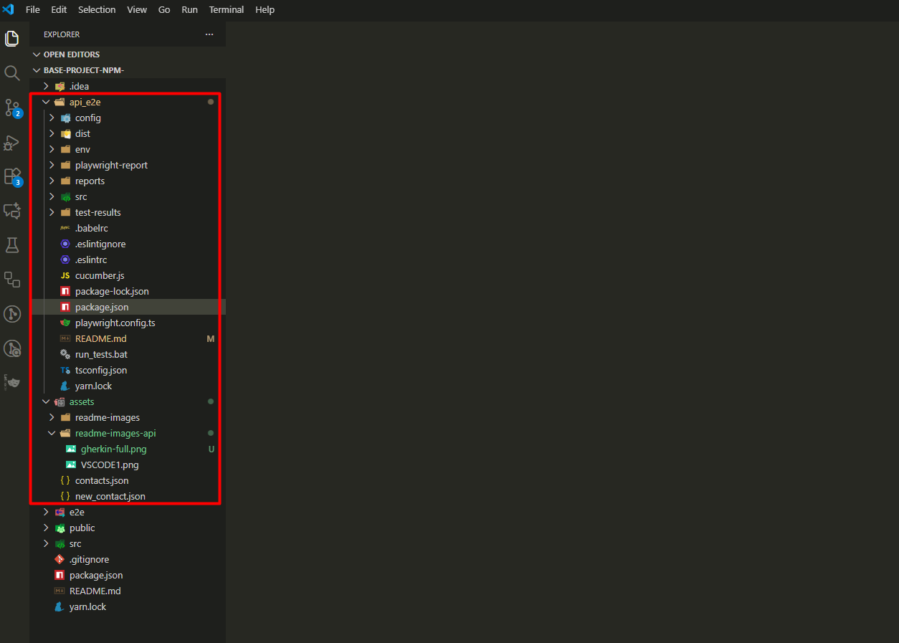

# API AUTOMATION FRAMEWORK WITH > Playwright + cucumber + typescript

Welcome to the API_E2E Automation Framework.

This project is designed as a modular, production-ready foundation for professional API testing.

Our primary objective is to empower testers—regardless of their experience level—to hit the ground running. By simply navigating to the api_e2e directory and executing a standard npm install, you will have a fully functional Playwright and Cucumber environment ready for execution.

While this base structure provides the essential architecture for request handling, data mapping, and automated reporting, it is intended to be a flexible starting point.

As you integrate this into your specific technical landscape, we encourage you to adapt the configurations, expand the step definitions, and enhance the utility helpers to meet the unique demands and robustness required by your project.

Before diving into the documentation tutorial, its important to have knowledge on the tools and language used in this particular project:

([What is playwright](https://playwright.dev/docs/intro))

([What is cucumber](https://cucumber.io/docs))

([What is typescript](https://www.typescriptlang.org/docs/))

<a name="index"></a>

## Index

1. [Installation](#installation)

   1.1 [VisualStudioCodeSettings](#visual-studio-code-settings)

2. [api_e2e-Folders](#folders-and-files-explanation)

   2.1 [Config-Folder](#e2e-config-folder)

   - [json_payloads](#json-payloads)

     2.2 [SRC folder](#api-e2e-src-folder)

   - [Env-Folder](#env-folder)

     - [ParsEnv.ts](#parsenv-ts-file)
     - [Global.ts](#global-ts-file)

   - [Features Folder](#features-folder)

     - [GET Feature](#get-feature-file)

   - [Reporter](#cucumber-report-ts-file)

   - [Common Env](#common-env-file)

   - [Support Folder](#support-folder)

     - [host helper](#host-helper-file)
     - [payload-helper](#payload-helper-file)
     - [rest helper](#rest-helper-file)

   - [Step Definitions](#step-definitions-folder)

     - [assertions](#assertions-folder)

       - [response steps](#response-steps-file)

     - [setup](#setup-folder)

       - [hooks](#hooks-file)
       - [world](#world-file)

     - [delete steps](#delete-steps-file)
     - [get steps](#get-steps-file)
     - [patch steps](#patch-steps-file)
     - [post steps](#post-steps-file)
     - [put steps](#put-steps-file)

     - [index](#index-file)

       2.3 [run tests bat](#run-tests-bat-file)

## Installation

Save the project:

Save the project folder “BASE-PROJECT-NPM” in the local disk of your computer and rename it if necessary.

Install Node JS recomended version - (https://nodejs.org/en/download/)

Install Visual Studio Code - (https://code.visualstudio.com)

Open Visual Studio Code:

<details>
<summary>Click to open Visual Studio image</summary>


</details>
<br>

Go to Extensions and install the Cucumber (Gherkin) Full Support:

<details>
<summary>Click to open Cucumber extension image</summary>


</details>
<br>

### Still on the extensions, install the follwoing:

- Cucumber;
- Playwright Test for VS Code;
- Playwright Test Runner;
- vscode-icons (optional).

On Visual Studio Code, click on the option "Open Folder" and open the project folder you saved on the previous step.

<details>
<summary>Click to open Visual Studio Code with project</summary>



</details>
<br>

The following dependencies are already created in the Package.json file:

```ts
{
  "name": "e2e",
  "version": "1.0.0",
  "description": "",
  "main": "index.js",
  "scripts": {
    "lint": "eslint . --ext .ts",
    "test": "rimraf dist && npx playwright test --reporter=html",
    "transpile": "rimraf dist && babel --extensions .ts --out-dir dist src",
    "precucumber": "rimraf reports && mkdir reports && echo {} > reports/report.json",
    "cucumber": "npm run transpile && cucumber-js",
    "postcucumber" : "ts-node ./src/reporter/cucumber-report.ts"
  },
  "author": "",
  "license": "ISC",
  "dependencies": {
    "@babel/cli": "^7.20.7",
    "@babel/core": "^7.20.7",
    "@babel/preset-env": "^7.20.2",
    "@babel/preset-typescript": "^7.18.6",
    "@cucumber/cucumber": "^11.1.1",
    "@playwright/test": "^1.29.1",
    "@typescript-eslint/eslint-plugin": "^5.48.0",
    "@typescript-eslint/parser": "^5.48.0",
    "cucumber-html-reporter": "^6.0.0",
    "dotenv": "^16.4.7",
    "eslint": "^8.31.0",
    "playwright": "^1.29.1",
    "ts-node": "^10.9.1",
    "typescript": "^4.9.4"
  }
}
```

These are all the dependencies that we need in the framework structure, to create and execute the test cases and the reports.

Open the Terminal in VS Code:

<details>
<summary>Click to open Terminal access image</summary>


</details>
<br>
 
 The terminal is opened:

<details>
<summary>Click to open Terminal image</summary>


</details>
<br>
 
Navigate to the api_e2e folder, which is where our end to end project structure is created.

To do this, type “cd api_e2e” and enter.

The route is now pointing to the api_e2e folder:

<details>
<summary>Click to open Route image</summary>


</details>
<br>
 
The dependencies are already in the package.json file, however, they are not installed yet.

Install the dependencies by writing the following command in the terminal:

To do this, run the command: **npm install** and click **enter**

All the dependencies are now installed.

The project structure inside the e2e folder, looks like this:

<details>
<summary>Click to open Project Structure image</summary>


</details>
<br>

## Visual Studio Code settings

Configure the Visual Studio settings.json file, so the cucumber features and the cucumber glue are pointing correctly to our Test Cases features folder and Step definitions.

**Note: Without this configuration, it will not be possible to execute the test cases.**

• Open Visual Studio code settings:

<details>
<summary>Click to open Cucumber Settings image</summary>


</details>
<br>
  
•	Search for cucumber:
 
<details>
<summary>Click to open Cucumber Search image</summary>


</details>
<br>
 
•	Click in "Editing settings" and define where the feature file is, in Cucumber.Features:

<details>
<summary>Click to open Edit Settings image</summary>


</details>
<br>
  
•	Define where the steps file is in cucumber features and in cucumber.features:

```ts
"api_e2e/src/features/*.feature"],
```

<details>
<summary>Click to open Cucumber Feature image</summary>


</details>
<br>
 
•	Define where the steps definitions file is, in cucumber.glue:

```ts
"api_e2e/src/step-definitions/**/*.ts",;
```

<details>
<summary>Click to open Cucumber Glue image</summary>


</details>
<br>

### The installation and visual studio configurations are completed.

#### Note: This base template project is already packed with example features tests.

- To guarantee that the npm install correctly installed all the dependencies, select one of the example tests in the features tests folder:

for example, choose the "GET.feature" test

Path:

src > features > GET.feature.

- Instert a @dev tag on the test scenario to be executed and save:

<details>
<summary>Click to open The test image</summary>


</details>
<br>

- On the terminal, Execute the test with the command ".\run_tests.bat dev"

<details>
<summary>Click to open the execution command</summary>


</details>
<br>

- After the execution, the tests will pass and a test report will be created automatically:

<details>
<summary>Click to open the execution result</summary>


</details>
<br>

To open the cucumber report, go to the folder "Reports > right click on "cucumber-html-report.html" and select "reveal on file explorer".

<details>
<summary>Click to open the cucumber report page</summary>


</details>
<br>

[Back to Index](#index)

## FOLDERS AND FILES EXPLANATION:

### E2E CONFIG FOLDER:

### api_e2e \> config folder:

The config folder contains the following folder and files:

- json payloads folder;
  - new post.json file;
  - new title.json file;
  - updated posts.jsons file;
- hosts.json file.

The config folder serves as the centralized repository for non-code resources required to execute the API tests. It separates the "what" (data and environment) from the "how" (the test logic).

Here is the purpose of the components inside this folder:

1. ### json payloads:
   This folder acts as a Data Bank for the API requests.

Request Templates: It stores the JSON bodies used for POST, PUT, or PATCH requests, such as new post.json and updated post.json.

Maintenance: Instead of hardcoding large JSON objects inside the Step Definitions, we import these files. This makes the code cleaner and allows us to update a request structure in one single place.

#### new post

```ts
{
    "title" : "New Post",
    "body" : "This is a new post",
    "userId" : 1
  }
```

<details>
<summary>Click to open new post code description</summary>
<br>

#### What is this file?

This is a JSON (JavaScript Object Notation) file. It is the standard format used by APIs to exchange data between a client (our test script) and a server.

Breakdown of the Fields:

- "title": This is a Key. Its Value is "New Post". It tells the API what the heading of the post should be.

- "body": This contains the actual content or message of the post.

- "userId": This is a numerical ID that identifies which user is "creating" this post.

#### What does it do?

The primary purpose of this file in your automation project is to serve as Test Data.

- Input Data: When your test runs a POST request (the command used to create something new on a server), your code reads this file and sends these specific details to the API.

- Consistency: By keeping this in a separate file, you ensure that every time you run the "Create Post" test, it uses the exact same data, making your tests predictable and reliable.

#### Why put it in the config folder?

to have as separation of Concerns:

- The Code: Stays in your src or steps folder (tells the test how to run).

- The Data: Stays in the config/json_payloads folder (tells the test what to send).

- This way, if you want to change the title of your test post, you don't have to touch the complex code; you just edit this simple text file.

### NOTE: The same logic applies for the other jason files inside the json_payload folder.

</details>
<br>

[Back to Index](#index)

#### host

```ts
{
    "localhost" : "https://localhost:5000",
    "production" : "https://jsonplaceholder.typicode.com"
  }
```

<details>
<summary>Click to open host code description</summary>
<br>

#### What is this file?

The hosts.json file acts as a GPS for your tests. It stores the Base URLs (addresses) of the different servers where your API might be running.

Instead of typing the full URL (e.g., https://jsonplaceholder.typicode.com/posts) inside every single test, we just tell the test to look here to find the right "home address."

### Data Structure

The file maps environment nicknames to their actual web addresses:

- localhost: Points to your own computer. This is used when a developer is writing new code and testing it locally before sharing it.

- production: Points to the live, public API. In this project, it points to JSONPlaceholder, a common fake API used for testing.

### What does this do in our tests?

This file allows our automation to be Dynamic.

- Switching Environments: If you want to run tests against your local machine, you tell the code to use the localhost key. If you want to test the real site, you switch to production.

- Centralized Control: If the API address ever changes (e.g., moving from version1.com to version2.com), you only have to change it once in this file, and every single test in your project is automatically updated.

- Concatenation: The test script takes the base URL from this file and adds the specific "endpoint" to the end of it.

Example: production address + /posts = https://jsonplaceholder.typicode.com/posts

### Why do we use this separate file?

This is the first step toward Professional DevOps practices:

- Security: It keeps environment-specific details out of the core logic.

- Portability: It allows the same test suite to run on your laptop, a colleague's laptop, or a specialized server (like a Jenkins or GitHub Actions runner) without changing the code.

- Efficiency: It prevents "Hardcoding." Hardcoding (writing the URL directly in the test) is a common beginner mistake that makes tests very difficult to maintain as the project grows.

</details>
<br>

[Back to Index](#index)

## API E2E SRC FOLDER:

In an automation framework, the src (source) folder is the Engine Room. While the config folder holds the data, the src folder contains the actual logic, code, and test scenarios that drive the automation.

- Location: api_e2e/src/

- The src folder contains the "Source Code" of your project. This is where the actual testing happens. It is organized into sub-folders to keep the logic separated from the test descriptions, making the project easier to scale and debug.

#### What does the SRC folder contain:

1. features/

- Purpose: Contains .feature files written in Gherkin (Given/When/Then).

- Role: This is the "Human-Readable" part of your tests. It describes what the test does in plain English so that non-developers can understand the test scenarios.

2. step-definitions/

- Purpose: The bridge between Gherkin and Code.

- Role: Every line written in a .feature file has a corresponding function here. When the test says "Given I have a new post," the code in this folder tells the computer exactly how to find that JSON file and prepare it.

3. support/

- Purpose: Helper functions and shared logic.

- Role: Contains reusable code used across many tests, such as custom API clients, authentication handlers, or specialized loggers. Think of this as your "Toolbox."

4. tests/

- Purpose: Low-level test scripts.

- Role: While features are for high-level scenarios, this folder often contains the specific Playwright or TypeScript logic that interacts directly with the API endpoints.

5. reporter/

- Purpose: Customizing test results.

- Role: Contains the logic for how your test results are formatted (e.g., generating HTML dashboards or sending results to Slack).

6. env/

- Purpose: Technical environment variables.

- Role: Stores configuration files (like .env) that handle sensitive or technical settings like timeouts, API keys, or secret tokens.

### ENV Folder:

This folder contains:

- global.ts file;
- parseEnv.ts file;

#### Global TS file:

```ts
import { APIResponse } from "@playwright/test";

export type GlobalAPIResponseVariables = { [key: string]: APIResponse };
export type HostsConfig = Record<string, string>;
export type JsonPayloadMappings = Record<string, string>;
export type JsonPayloadName = string;

export type GlobalConfig = {
  hostsConfig: HostsConfig;
  jsonPayloadMappings: JsonPayloadMappings;
};
```

<details>
<summary>Click to open global code description</summary>
<br>

- Location: api_e2e/src/env/global.ts

#### What is this file?

In technical terms, this is a TypeScript Definition File. Think of it as a "Rulebook" or a "Dictionary" for your project’s data.

In TypeScript, we don't just use data; we define the "shape" that data must take. This file defines the Types (blueprints) that the rest of the automation code must follow.

#### What it does

This file ensures that different parts of your automation "speak the same language" and don't make mistakes. Here is a breakdown of the definitions inside:

- GlobalAPIResponseVariables: It tells the system that when we store a response from the API (like a "Success" message), it must be a valid Playwright APIResponse. This prevents the code from accidentally trying to read a "Response" that doesn't exist.

- HostsConfig & JsonPayloadMappings: These define that our configurations (like the ones in hosts.json) must be a "Record" consisting of a Key (the name) and a String (the value/address).

- GlobalConfig: This is the "Master Blueprint." It tells the automation that whenever it loads the project configuration, it must include two things: a list of Hosts and a list of JSON Payloads.

#### Why is this important:

- Error Prevention: If you try to use a host that isn't a text string, or a payload that doesn't fit the mapping, the code editor will highlight it in red before you even run the test.

- Auto-Complete: Because these types are defined here, when you start typing code in other files, your editor (like VS Code) will suggest the correct options to you.

- Organization: It acts as a table of contents for the data structures used in the entire project.

</details>
<br>

[Back to Index](#index)

#### ParsEnv TS file:

```ts
export const env = (key: string): string => {
  const value = process.env[key];
  if (!value) {
    throw Error(`🧨 No environment variable found for ${key} 🧨`);
  }
  return value;
};

export const getJsonFromFile = <T = Record<string, string>>(
  path: string
): T => {
  return require(`${process.cwd()}${path}`);
};
```

<details>
<summary>Click to open parsEnv code description</summary>
<br>

- Location: api_e2e/src/env/parseEnv.ts

#### What is this file?

This file is a Utility Helper. If global.ts was the "Rulebook," parseEnv.ts is the "Translator" or "Fetcher." It contains small, reusable functions (tools) that know exactly how to go into your folders or your computer's system to grab the information your tests need to run.

#### What it does

It provides two main "tools" (functions) to the rest of your project:

1. The env tool (Variable Fetcher)

- Purpose: It searches your computer's "Environment Variables" for a specific name (key).

- The "Safety Net": If you ask for a variable that doesn't exist (like a missing API Key), instead of the test crashing quietly or acting weirdly, this tool throws a loud error: 🧨 No environment variable found for... 🧨.

- It forces you to fix configuration mistakes immediately rather than wasting time wondering why a test failed.

2. The getJsonFromFile tool (File Loader)

- Purpose: It knows how to find and open the JSON files we talked about earlier (like your new post.json).

- How it works: It takes the "path" (the address of the file) and combines it with process.cwd() (which is just code-speak for "the folder where this project is currently running").

- Result: It turns a text file on your hard drive into an actual JavaScript object that your test can send to an API.

#### Why is this important:

- Don't Repeat Yourself (DRY): Without this file, you would have to write complex code to "find and open files" inside every single test. Now, you just call getJsonFromFile and it’s done in one line.

- Error Handling: Beginners often struggle with "Undefined" errors. The 🧨 emoji error message makes it very clear what went wrong—you simply forgot to set a variable!

- Dynamic Paths: You don't have to worry about whether your project is running on a Mac, Windows, or a Linux server; process.cwd() handles the pathing logic for you automatically.

</details>
<br>

[Back to Index](#index)

### Features Folder:

### Get Feature File:

```ts
Feature: As an API I can retrieve posts

  @smoke @regression @dev
  Scenario: As an API I can retrieve all the posts
    Given I retrieve "posts"
    And the response was successful
    Then the response status code is 200

  @smoke @regression
  Scenario: As an API I can retrieve a single post
    Given I retrieve the 1st "posts"
    And the response was successful
    Then the response status code is 200
    And the response json contains the attributes:
      | id     | 1 |
      | userId | 1 |

  @smoke @regression
  Scenario: As an API I cannot retrieve animals
    Given I retrieve "animals"
    And the response was unsuccessful
    Then the response status code is 404
```

<details>
<summary>Click to open GET feature code description</summary>
<br>

Location: api_e2e/src/features/GET.feature

#### What it is

This is a Gherkin file. Gherkin is a plain-English language that allows anyone—developers, testers, or business managers—to read and understand what the automation is testing without needing to look at code. It uses a structured syntax called Given/When/Then.

#### What it does

It defines the Behavior of your API. Each part of this file has a specific job:

1. The Feature Header

- Feature: As an API I can retrieve posts: This is the high-level goal. It tells you that every test (Scenario) inside this file is related to fetching data from the API.

2. Tags (@smoke, @regression, @dev)

- Purpose: These are labels used to organize and filter your tests.

- How they work: Remember the command .\run_tests.bat @smoke? That command tells the system to only run the scenarios that have that specific tag.

3. Scenarios (The Test Cases)

- Each Scenario represents one specific thing you want to verify:

  - Scenario 1 (Retrieve all): Checks if the API can return a full list of posts.

  - Scenario 2 (Retrieve single): Checks if the API can find one specific post (ID #1) and verifies that the data inside (ID and UserID) is correct.

  - Scenario 3 (Error handling): Checks what happens when you ask for something that doesn't exist (animals). It verifies that the API is smart enough to say "Not Found" (404).

4. The Steps (The "Gherkin" Keywords)

- Given: Sets up the initial state (e.g., "I am looking for posts").

- And: Adds more conditions to the previous step.

- Then: This is the Assertion. This is where the test passes or fails based on the outcome (e.g., "Is the status code 200?").

#### Why is this important:

- Documentation that executes: This isn't just a text file; it is the actual "manual" for your API. If the API changes, the "manual" will fail, letting you know immediately.

- Focus on Logic: Beginners can write a Scenario without knowing how to code yet. You focus on what to test, and the step-definitions (which we will see next) handle how to do it.

- Data Tables: Notice the | id | 1 | section. This is a DataTable. It’s a clean way to check many different pieces of information at once without writing multiple lines of text.

### NOTE: The same logic applies for the other feature files inside the Features folder.

</details>
<br>

[Back to Index](#index)

### Cucumber report ts file:

```ts
import reporter, { Options } from "cucumber-html-reporter";
import { env } from "../env/parseEnv";
import dotenv from "dotenv";

dotenv.config({ path: env("COMMON_CONFIG_FILE") });

const options: Options = {
  theme: "bootstrap",
  jsonFile: env("JSON_REPORT_FILE"),
  output: env("HTML_REPORT_FILE"),
  reportSuiteAsScenarios: true,
  launchReport: false,
};

reporter.generate(options);
```

<details>
<summary>Click to open cucumber-report code description</summary>
<br>

Location: api_e2e/src/reporter/cucumber-report.ts

#### What it is

This is the Presentation Layer of your project. While the tests are running, they generate messy, technical data that is hard for humans to read. This file acts as a "Graphic Designer"—it takes those technical results and transforms them into a beautiful, professional HTML dashboard.

#### What it does

This script automates the creation of your post-test reports using three main steps:

1. Loading Configurations

- dotenv.config: It uses the env tool we discussed earlier to find the COMMON_CONFIG_FILE. This tells the reporter where to look for important settings, like file paths.

2. Setting the "Look and Feel" (options)

- This section defines exactly how the final report will look:

  - theme: 'bootstrap': It applies a modern, clean web design to the report.

  - jsonFile: It tells the reporter where the "raw" test data is hidden.

  - output: It defines the final name and location of the readable HTML file.

- launchReport: false: It tells the computer not to automatically pop open your web browser every single time a test finishes (which can be annoying during development).

3. Generating the Report

- reporter.generate(options): This is the final command that executes the transformation. It gathers the raw data, applies the theme, and saves the file to your disk.

#### Why is this important:

- Visual Feedback: Instead of staring at a black terminal screen with white text, you get colorful charts (Green for Pass, Red for Fail).

- Evidence: If a test fails, this report provides a clear record of exactly what went wrong, which you can share with your team or developers to prove there is a bug.

- Professionalism: Using a structured reporter shows that your automation framework is "Production Ready." It makes it easy for managers or stakeholders to see the health of the API at a glance.

</details>
<br>

[Back to Index](#index)

### Common env file:

```ts
CUCUMBER_PUBLISH_QUIET = true;
API_AUTOMATION_HOST = production;
HOSTS_URLS_PATH = /config/hosst.json;
JSON_REPORT_FILE = "./reports/report.json";
HTML_REPORT_FILE = "./reports/cucumber-html-report.html";
JSON_PAYLOAD_PATH = "/config/json_payloads/";
PARALLEL = 1;
RETRY = 1;
```

<details>
<summary>Click to open the common env code description</summary>
<br>

- Location: api_e2e/env/common.env

#### What it is

This is a Configuration File (specifically an Environment file). While the .ts files we looked at earlier are the "logic" that reads data, this file is the "Control Panel" for your entire project. It contains a list of settings that change how the automation behaves without you having to touch a single line of code.

#### What it does

It stores Key-Value pairs that act as global constants for your tests. Here is what each setting controls:

- CUCUMBER_PUBLISH_QUIET=true: This keeps your terminal clean. It tells Cucumber not to nag you about uploading your reports to their public cloud every time you run a test.

API_AUTOMATION_HOST=production: This tells the framework which key to look for in your hosts.json. By changing this one word to localhost, you can redirect your entire test suite to a different server.

HOSTS_URLS_PATH & JSON_PAYLOAD_PATH: These define the "Home Address" for your configuration folders. It tells the parseEnv.ts tool exactly where to find your URLs and JSON data.

JSON_REPORT_FILE & HTML_REPORT_FILE: These tell the cucumber-report.ts file exactly where to save the results of your tests so you can find them later in the reports folder.

PARALLEL & RETRY: These are performance settings. PARALLEL=1 means tests run one by one, and RETRY=1 means if a test fails due to a random network glitch, the system will automatically try to run it one more time before marking it as a failure.

#### Why is this important:

- Centralized Control: Imagine you have 100 tests. If you want to change where the reports are saved, you don't edit 100 files; you change one line here.

- Environmental Flexibility: This file allows your project to be "Portable." When you move your code from your laptop to a professional server, you often only need to update this common.env file to make everything work perfectly in the new location.

- Readability: It serves as a "Quick Look" at how the project is configured. Anyone can open this file and immediately see which host is being tested and where the payloads are stored.

</details>
<br>

[Back to Index](#index)

#### Support Folder

The support folder contains the "machinery" that powers your tests. Let's start with the host-helper.ts.

### Host helper file:

```ts
import { GlobalConfig } from "../env/global";

export const retrieveHostURL = ({ hostsConfig }: GlobalConfig): URL => {
  const { API_AUTOMATION_HOST: hostname = "production" } = process.env;

  const hostPath = hostsConfig[hostname];

  const url = new URL(hostPath);

  return url;
};
```

<details>
<summary>Click to open the host helper code description</summary>
<br>

- Location: api_e2e/src/support/host-helper.ts

#### What it is

This file is a Logic Helper. If the hosts.json file is your GPS address book, then host-helper.ts is the Navigator.

- Its job is to look at your current settings, find the correct address (URL) from your address book, and prepare it so the automation can travel there.

#### What it does

This script contains a specific function called retrieveHostURL that performs a step-by-step process:

- Check the Environment: It looks at your common.env file (via process.env) to see which host you want to use (e.g., production or localhost). If you haven't specified one, it defaults to 'production'.

- Look up the Address: It takes that name (like "production") and looks it up inside your hostsConfig (the data loaded from hosts.json).

- Validate the URL: It takes the text string (e.g., "https://jsonplaceholder.typicode.com") and converts it into a formal URL Object. This is like verifying that an address is a real place before you start driving.

- Handover: It returns that validated URL so that your API tests know exactly where to send their requests.

#### Why is this important:

- Automatic Intelligence: You don't have to manually tell the test which URL to use every time. This script "figures it out" for you based on your configuration.

- Safety: By converting the text to a "URL Object," it ensures that if you accidentally typed a bad address in your config file (like forgetting the https://), the system can catch that error early.

- Code Reusability: Instead of writing the logic to find the URL inside every single test file, we write it once here and reuse it everywhere.

</details>
<br>

[Back to Index](#index)

### Payload helper file:

```ts
import { env } from "../env/parseEnv";

export const payloadExists = (jsonPayload: any): void => {
  if (jsonPayload === undefined) {
    throw Error(
      `🧨 JSON Payload not defined in ${env("JSON_PAYLOAD_PATH")} 🧨`
    );
  }
  return jsonPayload;
};
```

<details>
<summary>Click to open the Payload helper code description</summary>
<br>

- Location: api_e2e/src/support/payload-helper.ts

#### What it is

This file acts as a Quality Inspector for your data. In API testing, if you try to send a request with a file that doesn't exist or is empty, the test will fail with a confusing error message. This "helper" exists to catch those mistakes early and explain exactly what went wrong in plain English.

#### What it does

It contains a safety function called payloadExists that performs a "check-up" on your JSON files:

- The Existence Check: Whenever the automation tries to load a file (like new post.json), this function checks if the data actually arrived.

- The Panic Button (Error Handling): If the file is missing or undefined, the function stops the test immediately and throws a clear error: 🧨 JSON Payload not defined in [path] 🧨.

- The Green Light: If the file is found and valid, it simply passes the data along to the test so the API request can be made.

#### Why is this important:

- Clearer Debugging: Without this, a missing file might cause a "Crash" with a generic error like Cannot read property 'title' of undefined. With this helper, you get a specific message telling you exactly which folder is missing the file.

- Path Transparency: By using the env('JSON_PAYLOAD_PATH') inside the error message, the helper reminds you exactly where the system is looking for your files.

- Prevents "Silent Failures": It ensures that a test never "half-runs" with missing data. It’s better for a test to fail immediately with a good explanation than to continue and give a false result.

</details>
<br>

[Back to Index](#index)

### Rest helper file:

```ts
import { APIRequestContext, APIResponse } from "playwright";
import {
  GlobalConfig,
  GlobalAPIResponseVariables,
  JsonPayloadName,
} from "../env/global";
import { retrieveHostURL } from "./host-helper";
import { payloadExists } from "./payload-helper";

export const getResponse = async (
  request: APIRequestContext,
  route: string,
  globalConfig: GlobalConfig,
  globalAPIResponseVariables: GlobalAPIResponseVariables
): Promise<APIResponse> => {
  const url = retrieveHostURL(globalConfig);

  const response = await request.get(url.href + route);

  globalAPIResponseVariables.response = response;

  return response;
};

export const deleteResponse = async (
  request: APIRequestContext,
  route: string,
  globalConfig: GlobalConfig,
  globalAPIResponseVariables: GlobalAPIResponseVariables
): Promise<APIResponse> => {
  const url = retrieveHostURL(globalConfig);

  const response = await request.delete(url.href + route);

  globalAPIResponseVariables.response = response;

  return response;
};

export const postResponse = async (
  request: APIRequestContext,
  route: string,
  jsonPayloadName: JsonPayloadName,
  globalConfig: GlobalConfig,
  globalAPIResponseVariables: GlobalAPIResponseVariables
): Promise<APIResponse> => {
  const url = retrieveHostURL(globalConfig);

  const payload = payloadExists(
    globalConfig.jsonPayloadMappings[jsonPayloadName]
  );

  const response = await request.post(url.href + route, { data: payload });

  globalAPIResponseVariables.response = response;

  return response;
};

export const patchResponse = async (
  request: APIRequestContext,
  route: string,
  jsonPayloadName: JsonPayloadName,
  globalConfig: GlobalConfig,
  globalAPIResponseVariables: GlobalAPIResponseVariables
): Promise<APIResponse> => {
  const url = retrieveHostURL(globalConfig);

  const payload = payloadExists(
    globalConfig.jsonPayloadMappings[jsonPayloadName]
  );

  const response = await request.patch(url.href + route, { data: payload });

  globalAPIResponseVariables.response = response;

  return response;
};

export const putResponse = async (
  request: APIRequestContext,
  route: string,
  jsonPayloadName: JsonPayloadName,
  globalConfig: GlobalConfig,
  globalAPIResponseVariables: GlobalAPIResponseVariables
): Promise<APIResponse> => {
  const url = retrieveHostURL(globalConfig);

  const payload = payloadExists(
    globalConfig.jsonPayloadMappings[jsonPayloadName]
  );

  const response = await request.put(url.href + route, { data: payload });

  globalAPIResponseVariables.response = response;

  return response;
};
```

<details>
<summary>Click to open the Rest helper code description</summary>
<br>

- Location: api_e2e/src/support/rest-helper.ts

#### What it is

This is the Core Communication Engine of your framework. It uses Playwright to send actual HTTP requests to the API. Instead of writing complex networking code inside your tests, you use these pre-built functions to perform the standard "actions" of the web: GET, POST, PUT, PATCH, and DELETE.

#### What it does

This file contains specialized functions for each type of API interaction. Every function follows a similar "Mission Plan":

- Find the Destination: It calls retrieveHostURL to get the base address (e.g., https://jsonplaceholder.typicode.com).

- Combine the Route: It attaches the specific endpoint (like /posts) to that address.

- Attach the Data (for POST/PUT/PATCH): It uses payloadExists to grab the JSON data you want to send.

- Execute the Action: It tells Playwright to send the request (e.g., request.post).

- Record the Result: It saves the API's answer into globalAPIResponseVariables.response so that your tests can check it later.

#### The "Action" Breakdown:

- getResponse: Asks the API for information (Reading).

- postResponse: Sends new data to the API (Creating).

- putResponse: Replaces an entire record with new data (Updating).

- patchResponse: Updates only a specific part of a record (Modifying).

- deleteResponse: Tells the API to remove a record (Deleting).

#### Why is this important:

- Standardization: Every time you send a POST request, it happens exactly the same way. This prevents "flaky" tests caused by inconsistent code.

- Abstraction: As a beginner, you don't need to worry about the "headers" or "connection strings." You just say "I want to post this JSON to this route," and this helper handles the technical details.

- Centralized Storage: Because every function saves the result in globalAPIResponseVariables.response, your "Then" steps (assertions) always know exactly where to look to see if the test passed.

</details>
<br>

[Back to Index](#index)

#### Step Definitions folder:

The step-definitions folder is where the human-readable steps from your .feature files are mapped to machine-executable code.

When Cucumber reads a line like Then the response status code is 200, it looks inside this folder to find the exact TypeScript function that knows how to perform that check. It acts as the bridge between your test requirements and the Playwright engine.

#### Assertions folder

### Response steps file:

```ts
import { DataTable, Then } from "@cucumber/cucumber";
import { ScenarioWorld } from "../setup/world";
import { expect } from "@playwright/test";

Then(
  /^the response was (successful)?(unsuccessful)?$/,
  async function (
    this: ScenarioWorld,
    success: boolean,
    unsuccessful: boolean
  ) {
    const { globalAPIResponseVariables } = this;

    console.log(
      `the response was ${unsuccessful ? "unsuccessful " : "successful "} `
    );

    const response = globalAPIResponseVariables.response;

    if (unsuccessful) {
      expect(response.ok()).toBeFalsy();
    } else {
      expect(response.ok()).toBeTruthy();
    }
  }
);

Then(
  /^the response status code is (\d*)$/,
  async function (this: ScenarioWorld, statusCode: string) {
    const { globalAPIResponseVariables } = this;

    console.log(`the response status code is ${statusCode}`);

    const response = globalAPIResponseVariables.response;

    expect(response.status()).toBe(Number(statusCode));
  }
);

Then(
  /^the response json contains the attributes:$/,
  async function (this: ScenarioWorld, dataTable: DataTable) {
    const { globalAPIResponseVariables } = this;

    console.log(
      `the response json contains the attributes: ${dataTable.raw()}`
    );

    const response = await globalAPIResponseVariables.response.json();

    const expected_response = dataTable.raw();

    for (let i = 0; i < expected_response.length; i++) {
      for (let j = 0; j < expected_response[i].length; j++) {
        expect(JSON.stringify(response)).toContain(expected_response[i][j]);
      }
    }
  }
);

Then(
  /^the response text contains the attributes:$/,
  async function (this: ScenarioWorld, dataTable: DataTable) {
    const { globalAPIResponseVariables } = this;

    console.log(
      `the response text contains the attributes: ${dataTable.raw()}`
    );

    const response = await globalAPIResponseVariables.response.text();

    const expected_response = dataTable.raw();

    for (let i = 0; i < expected_response.length; i++) {
      for (let j = 0; j < expected_response[i].length; j++) {
        expect(response).toContain(expected_response[i][j]);
      }
    }
  }
);
```

<details>
<summary>Click to open the Response Steps code description</summary>
<br>

- Location: api_e2e/src/step-definitions/assertions/response-steps.ts

#### What it is

This file contains your Assertions (also known as "Checks" or "Verifications"). In the world of testing, an assertion is a "pass/fail" checkpoint. This specific file focuses on inspecting the Response we get back from the API to make sure it matches our expectations.

#### What it does

It provides four main verification tools (Steps) for your features:

1. Success/Failure Check
   - Step: Then the response was successful

- Action: It checks if the API returned a "success" status (usually codes between 200–299). If you write unsuccessful, it checks that the API properly returned an error.

2. Status Code Check
   - Step: Then the response status code is 200

- Action: It looks at the exact number the server sent back. If you expect a 200 but the server sends a 404, this step will fail the test and tell you exactly what the difference was.

3. JSON Attribute Check
   - Step: And the response json contains the attributes:

- Action: This is a powerful tool that uses a DataTable. It converts the API's response into a JSON object and loops through your table to ensure every piece of data you expected (like id or userId) is actually present in the response.

4. Raw Text Check
   - Step: And the response text contains the attributes:

- Action: Similar to the JSON check, but it looks at the response as a plain "blob" of text. This is useful for checking error messages or simple text responses that aren't formatted as JSON.

#### Why is this important:

- Reusability: You only had to write the logic for checking a status code once. Now, you can use that same English sentence in 100 different feature files.

- Clear Logs: Notice the console.log lines. When your test runs, it prints exactly what it is checking to the terminal, making it very easy to follow the progress.

- Separation of Logic: By keeping assertions in their own sub-folder (assertions), the project stays organized. You know exactly where to go if you want to add a new way to verify an API response.

</details>
<br>

[Back to Index](#index)

#### Setup folder

The setup folder contains the "Global Managers" of your project. It handles the preparation and cleanup required for every test. Without this folder, your tests wouldn't have a place to store data or a way to start themselves properly.

### Hooks file:

```ts
import { Before } from "@cucumber/cucumber";
import { ScenarioWorld } from "./world";

Before(async function (this: ScenarioWorld, scenario) {
  console.log(`Running cucumber scenario ${scenario.pickle.name}`);

  const ready = await this.init();
  return ready;
});
```

<details>
<summary>Click to open the Hooks code description</summary>
<br>

- Location: api_e2e/src/step-definitions/setup/hooks.ts

#### What it is

In Cucumber, Hooks are blocks of code that run at specific points in the test lifecycle (like before or after a scenario). Think of hooks.ts as the "Janitor and Pre-flight Crew" of your automation. It ensures the "room" is ready before the test starts and cleaned up when it finishes.

#### What it does

The file currently uses a Before hook, which performs the following actions every single time a test scenario begins:

- Logging: It prints Running cucumber scenario [Name] to your terminal. This makes it easy to track which test is currently running in your logs.

- Initialization: It calls this.init(). This is a crucial step that prepares the "World" (where your variables and API settings live) so that the steps have everything they need to run.

- Synchronization: By using await, it ensures the setup is 100% complete before the first line of your .feature file is executed.

#### Why is this important:

- Automation of Repetitive Tasks: You don't have to manually "start" the engine in every test; the Before hook does it for you automatically.

- Traceability: If a test fails, the log created by this hook tells you exactly which scenario was running, saving you time during debugging.

- Reliability: It ensures every test starts with a "Fresh Slate," which prevents data from one test from accidentally interfering with another.

</details>
<br>

[Back to Index](#index)

### World file:

```ts
import playwright, { APIRequestContext } from "playwright";
import { World, IWorldOptions, setWorldConstructor } from "@cucumber/cucumber";
import { GlobalAPIResponseVariables, GlobalConfig } from "../../env/global";

export type Api = {
  request: APIRequestContext;
};

export class ScenarioWorld extends World {
  constructor(options: IWorldOptions) {
    super(options);

    this.globalAPIResponseVariables = {};
    this.globalConfig = options.parameters as GlobalConfig;
  }

  globalConfig: GlobalConfig;

  globalAPIResponseVariables: GlobalAPIResponseVariables;

  api!: Api;

  async init(): Promise<Api> {
    const request = await this.newRequest();

    this.api = { request };

    return this.api;
  }

  private newRequest = async (): Promise<APIRequestContext> => {
    const request = await playwright.request.newContext({
      extraHTTPHeaders: {
        "Content-type": "application/json; charset=UTF-8",
      },
    });

    return request;
  };
}

setWorldConstructor(ScenarioWorld);
```

<details>
<summary>Click to open the World file code description</summary>
<br>

- Location: api_e2e/src/step-definitions/setup/world.ts

#### What it is

In Cucumber, the World is an isolated context (a "storage box") that is created for each individual scenario. It allows different step definitions to share information with each other. For example, if one step creates a post and another step checks that post, the "World" is where that information is held so both steps can see it.

#### What it does

This file defines the ScenarioWorld class, which manages three main things:

1. Data Storage (globalConfig & globalAPIResponseVariables)

- globalConfig: It stores all the settings we defined in common.env (like which host we are using).

- globalAPIResponseVariables: This is the "temporary memory" that holds the API's response so that your assertion steps (like response-steps.ts) can inspect it later.

2. The API Request Engine (newRequest)

- This is a private helper that uses Playwright to set up the technical communication rules.

- It automatically adds extraHTTPHeaders (like 'Content-type': 'application/json') to every request, so you don't have to manually tell the API you are sending JSON every single time.

3. The Initialization (init)

- Remember this.init() in the hooks.ts file? This is what it runs.

- It triggers the creation of a new request context, ensuring that every test starts with a clean, fresh connection to the server.

#### Why is this important:

- State Management: Without the "World," Step A wouldn't know what Step B just did. This file provides the "shared memory" that makes multi-step tests possible.

- Clean Code: By setting the default headers (like application/json) here once, you save yourself from repeating that code in every single test file.

- Isolation: Because a new "World" is created for every scenario, you don't have to worry about data from "Test 1" accidentally leaking into "Test 2." Each test gets its own private "Cockpit."

</details>
<br>

[Back to Index](#index)

### Delete steps file:

```ts
import { Given } from "@cucumber/cucumber";
import { ScenarioWorld } from "./setup/world";
import { deleteResponse } from "../support/rest-helper";

Given(
  /^I delete the ([0-9]+th|[0-9]+st|[0-9]+nd|[0-9]+rd) "([^"]*)"$/,
  async function (this: ScenarioWorld, index: string, route: string) {
    const {
      api: { request },
      globalConfig,
      globalAPIResponseVariables,
    } = this;

    console.log(`I delete the ${index} ${route}`);

    const currentIndex = Number(index.match(/\d/g)?.join(""));

    const routeAtIndex = `${route}/${currentIndex}`;

    await deleteResponse(
      request,
      routeAtIndex,
      globalConfig,
      globalAPIResponseVariables
    );
  }
);
```

<details>
<summary>Click to open the Delete steps file code description</summary>
<br>

- Location: api_e2e/src/step-definitions/delete-steps.ts

#### What it is

This file is an Action Definition. While the assertions folder checks the results, this file defines the intent to perform a specific action—in this case, telling the API to delete a specific resource. It uses a Regular Expression (the complex text between /^...$/) to allow for flexible, human-like sentences in your feature files.

#### What it does

This file defines a single, powerful Given step that handles the logic for deleting items by their position or ID:

- The "Delete" Logic

  - The Step: Given I delete the 1st "posts" (or 2nd, 3rd, 10th, etc.).

  - Smart Indexing: The code uses a "Regex" to look at words like 1st or 23rd and extract just the number (1 or 23).

  - Route Building: It automatically builds the correct URL path for the API. For example, if you say 1st "posts", it creates the path posts/1.

  - The Execution: It pulls the request engine and the globalConfig from the World we discussed earlier and passes them to the deleteResponse helper to perform the actual work.

#### Why is this important:

- Natural Language: You don't have to write DELETE /posts/1. You can write a sentence that sounds like English, making the test easier to read for everyone on the team.

- Flexibility: Because of the number processing (1st, 2nd, etc.), you can use this one single step to delete any item in any category (posts, users, comments) just by changing the words in the .feature file.

- Console Transparency: Like your other steps, it logs exactly what it is doing (I delete the 1st posts) so you can follow the test's progress in real-time.

</details>
<br>

[Back to Index](#index)

### get steps file:

```ts
import { Given } from "@cucumber/cucumber";
import { ScenarioWorld } from "./setup/world";
import { getResponse } from "../support/rest-helper";

Given(
  /^I retrieve "([^"]*)"$/,
  async function (this: ScenarioWorld, route: string) {
    const {
      api: { request },
      globalAPIResponseVariables,
      globalConfig,
    } = this;

    console.log(`I retrieve ${route}`);

    await getResponse(request, route, globalConfig, globalAPIResponseVariables);
  }
);

Given(
  /^I retrieve the ([0-9]+th|[0-9]+st|[0-9]+nd|[0-9]+rd) "([^"]*)"$/,
  async function (this: ScenarioWorld, index: string, route: string) {
    const {
      api: { request },
      globalConfig,
      globalAPIResponseVariables,
    } = this;

    console.log(`I retrieve the ${index} ${route}`);

    const currentIndex = Number(index.match(/\d/g)?.join(""));

    const routeAtIndex = `${route}/${currentIndex}`;

    await getResponse(
      request,
      routeAtIndex,
      globalConfig,
      globalAPIResponseVariables
    );
  }
);
```

<details>
<summary>Click to open the Get steps file code description</summary>
<br>

- Location: api_e2e/src/step-definitions/get-steps.ts

#### What it is

This file contains the Retrieval Logic. It translates the simple English "I retrieve..." into an HTTP GET request. Like the delete steps, it uses Regular Expressions to capture specific words from your feature file—such as the name of the resource (e.g., "posts") or the specific number of an item (e.g., "1st").

#### What it does

This file defines two different ways to ask the API for information:

1. Retrieve All (The General Search)

- The Step: Given I retrieve "posts"

- Action: This sends a request to the main endpoint (e.g., https://api.com/posts).

- Result: It tells the API, "Give me everything you have in this category."

2. Retrieve a Specific Item (The Targeted Search)

- The Step: Given I retrieve the 1st "posts"

- Action: 1. It uses a number filter to turn 1st into the number 1. 2. It attaches that number to the route, creating a specific path like posts/1. 3. It sends the request to the API.

- Result: It tells the API, "I only want the information for this one specific item."

#### Why is this important:

- Dynamic Routing: You don't have to write a new piece of code every time you want to test a different part of the API. You can simply change the word in your feature file from "posts" to "comments" or "users", and this code handles it automatically.

- Data Persistence: Once the data is retrieved, it is saved into globalAPIResponseVariables. This allows your "Then" steps to check the content of what was just downloaded.

- Human-Readable Indices: Using 1st, 2nd, or 3rd in the feature files makes the tests feel more natural and less like a math equation, while the code behind the scenes handles the "translation" to computer-friendly numbers.

</details>
<br>

[Back to Index](#index)

### patch steps file:

```ts
import { Given } from "@cucumber/cucumber";
import { ScenarioWorld } from "./setup/world";
import { JsonPayloadName } from "../env/global";
import { patchResponse } from "../support/rest-helper";

Given(
  /^I patch the ([0-9]+th|[0-9]+st|[0-9]+nd|[0-9]+rd) "([^"]*)" with an "([^"]*)"$/,
  async function (
    this: ScenarioWorld,
    index: string,
    route: string,
    jsonPayloadName: JsonPayloadName
  ) {
    const {
      api: { request },
      globalConfig,
      globalAPIResponseVariables,
    } = this;

    console.log(`I patch the ${index} ${route} with an ${jsonPayloadName}`);

    const currentIndex = Number(index.match(/\d/g)?.join(""));

    const routeAtIndex = `${route}/${currentIndex}`;

    await patchResponse(
      request,
      routeAtIndex,
      jsonPayloadName,
      globalConfig,
      globalAPIResponseVariables
    );
  }
);
```

<details>
<summary>Click to open the Patch steps file code description</summary>
<br>

- Location: api_e2e/src/step-definitions/patch-steps.ts

#### What it is

This file contains the Partial Update Logic. A PATCH request is used when you want to change only a specific part of an existing item (like just the title of a post) rather than replacing the whole thing. This step definition bridges the gap between your human-readable test, the specific resource on the server, and the data file you want to send.

#### What it does

This file defines a sophisticated Given step that manages three pieces of information simultaneously:

- The Step: Given I patch the 1st "posts" with an "new title"

- Targeting the Resource:

  - It takes the index (e.g., 1st) and extracts the number 1.

  - It combines it with the route (e.g., posts) to create the specific address: posts/1.

  - Loading the Data: It looks for the JsonPayloadName (e.g., new title) inside your configuration mappings.

  - Executing the Modification: It calls the patchResponse helper, passing the Playwright request engine, the specific route, and the data payload to be updated.

  - Logging: It prints a clear message to the console showing which item is being patched and with which data file.

#### Why is this important:

- Surgical Precision: This allows you to test that the API is smart enough to update a single field without accidentally deleting or changing other data in the same record.

- Connecting the Dots: This is the first time we see the World, the Config, and the Support Helpers all working together to move a file from your config/json_payloads/ folder onto the API server.

- Dynamic Reusability: You can use this same line of code to patch anything—a user's email, a post's title, or a comment's body—simply by changing the name of the JSON payload file in your feature.

</details>
<br>

[Back to Index](#index)

### Post steps file:

```ts
import { Given } from "@cucumber/cucumber";
import { ScenarioWorld } from "./setup/world";
import { JsonPayloadName } from "../env/global";
import { postResponse } from "../support/rest-helper";

Given(
  /^I create a new "([^"]*)" with "([^"]*)"$/,
  async function (
    this: ScenarioWorld,
    route: string,
    jsonPayloadName: JsonPayloadName
  ) {
    const {
      api: { request },
      globalConfig,
      globalAPIResponseVariables,
    } = this;

    console.log(`I create a new ${route} with ${jsonPayloadName}`);

    await postResponse(
      request,
      route,
      jsonPayloadName,
      globalConfig,
      globalAPIResponseVariables
    );
  }
);
```

<details>
<summary>Click to open the Post steps file code description</summary>
<br>

- Location: api_e2e/src/step-definitions/post-steps.ts

#### What it is

This file contains the Creation Logic. It maps the Gherkin command for creating data to an HTTP POST request. While the "Get" and "Delete" steps focus on existing IDs, the post-steps.ts focuses on taking a name (like "new post") and finding the corresponding JSON file to upload to the API.

#### What it does

This file defines a Given step that acts as the "Submit" button for your test data:

- The Step: Given I create a new "posts" with "new post".

- Identifying the Target: It takes the route (e.g., "posts") to know where to send the data on the server.

- Mapping the Data: It takes the jsonPayloadName (e.g., "new post") and looks up the physical file path using the configurations we set up in the env and config folders.

- The Handover: It extracts the request engine and globalConfig from the World.

- Execution: It calls the postResponse helper, which packages the JSON data and the URL together to send the request to the API.

#### Why is this important:

- Data-Driven Testing: You can create hundreds of different types of posts just by adding new JSON files to your config folder and referencing their names in your feature files—no new code required.

- State Change: This is a "Write" operation. After this step runs successfully, you would typically use a "Get" step or an "Assertion" step to verify that the new item actually exists on the server.

- Simplified Workflow: By using this step, you don't have to worry about the technical details of headers or body formatting; you just provide the name of the file you want to "upload".

</details>
<br>

[Back to Index](#index)

### Put steps file:

```ts
import { Given } from "@cucumber/cucumber";
import { ScenarioWorld } from "./setup/world";
import { JsonPayloadName } from "../env/global";
import { putResponse } from "../support/rest-helper";

Given(
  /^I update the ([0-9]+th|[0-9]+st|[0-9]+nd|[0-9]+rd) "([^"]*)" with an "([^"]*)"$/,
  async function (
    this: ScenarioWorld,
    index: string,
    route: string,
    jsonPayloadName: JsonPayloadName
  ) {
    const {
      api: { request },
      globalConfig,
      globalAPIResponseVariables,
    } = this;

    console.log(`I update the ${index} ${route} with an ${jsonPayloadName}`);

    const currentIndex = Number(index.match(/\d/g)?.join(""));

    const routeAtIndex = `${route}/${currentIndex}`;

    await putResponse(
      request,
      routeAtIndex,
      jsonPayloadName,
      globalConfig,
      globalAPIResponseVariables
    );
  }
);
```

<details>
<summary>Click to open the Put steps file code description</summary>
<br>

- Location: api_e2e/src/step-definitions/put-steps.ts

#### What it is

This file contains the Replacement Logic. In API terms, a PUT request is used to update an existing resource by replacing it entirely with new data. This step definition takes a specific item (like the "1st post") and sends a complete JSON payload to overwrite whatever was there before.

#### What it does

This file defines a Given step that manages the complete transformation of a piece of data:

- The Step: Given I update the 1st "posts" with an "new post".

- Locating the Target: \* It parses the index (e.g., 1st) to get the ID 1.

- It builds the specific URL path: posts/1.

- Loading the New Version: It fetches the JSON data named "new post" from your configuration.

- The Overwrite: It calls the putResponse helper, sending the new data to the specific address to replace the old record.

- Storage: Just like the other steps, the API's confirmation response is saved in the World so you can verify the update was successful in the next step.

#### Why is this important:

- PUT vs. PATCH: While PATCH (which we saw earlier) is for small tweaks, PUT is for a "Complete Overhaul." Having both allows you to test that your API handles both types of updates correctly.

- Consistency: This step uses the same "Index" logic as the Delete and Get steps (1st, 2nd, etc.), making the language consistent across your entire testing suite.

- Error Prevention: Because it uses the putResponse helper, it automatically benefits from the safety checks in payload-helper.ts, ensuring you don't try to update a post with a file that doesn't exist.

</details>
<br>

[Back to Index](#index)

### Index file:

If the other files were individual instruments, index.ts is the Conductor of the entire orchestra.

```ts
import dotenv from "dotenv";
import { env, getJsonFromFile } from "./env/parseEnv";
import { GlobalConfig, HostsConfig, JsonPayloadMappings } from "./env/global";
import * as fs from "fs";

dotenv.config({ path: env("COMMON_CONFIG_FILE") });

const hostsConfig: HostsConfig = getJsonFromFile(env("HOSTS_URLS_PATH"));
const payloadFiles = fs.readdirSync(
  `${process.cwd()}${env("JSON_PAYLOAD_PATH")}`
);

const jsonPayloadMappings: JsonPayloadMappings = payloadFiles.reduce(
  (payloadConfigAcc, file) => {
    const key = file.replace(".json", "");
    const payloadMappings = getJsonFromFile(
      `${env("JSON_PAYLOAD_PATH")}${file}`
    );
    return { ...payloadConfigAcc, [key]: payloadMappings };
  },
  {}
);

const worldParameters: GlobalConfig = {
  hostsConfig,
  jsonPayloadMappings,
};

const common = `./src/features/**/*.feature \
          --require-module ts-node/register \
          --require ./src/step-definitions/**/**/*.ts \
          --world-parameters ${JSON.stringify(worldParameters)}
          -f json:./reports/report.json \
          --parallel ${env("PARALLEL")} \
          --retry ${env("RETRY")} \
          --format progress-bar`;

const dev = `${common} --tags '@dev'`;
const smoke = `${common} --tags '@smoke'`;
const regression = `${common} --tags '@regression'`;

console.log(`\n 👾 👾 👾 👾 👾 👾 👾 👾 👾 👾 \n`);

export { dev, smoke, regression };
```

<details>
<summary>Click to open the Index file code description</summary>
<br>

- Location: api_e2e/src/index.ts

#### What it is

This is the Orchestrator. It is the first file to "wake up" when you run your tests. Its job is to gather all the configurations, files, and settings we’ve discussed and bundle them together into a single "Instruction Manual" that it hands over to the Cucumber engine to start the tests.

#### What it does

This file performs four critical setup phases:

1. Environment Activation

- dotenv.config: It reads your common.env file. This is the moment the project learns things like "I am testing in production" and "Save my reports in this folder."

2. Data Mapping (The "Brain" Building)

- hostsConfig: It loads the hosts.json address book.

- jsonPayloadMappings: This is very clever—it scans your json_payloads folder and automatically maps every .json file to a name. This is why you can just type "new post" in a feature file; this code has already linked that name to the actual file on your hard drive.

3. Defining the "World Parameters"

- It takes all that mapped data and packages it into worldParameters. This package is then injected into the World (world.ts), which is why every test step has instant access to your URLs and JSON data.

4. The Execution Commands

- The common variable builds the actual command line that runs Cucumber. It defines:

- Where the tests are: ./src/features/\*_/_.feature

- Where the code is: ./src/step-definitions/**/**/\*.ts

- Reporting settings: Generates the report.json for your HTML reporter.

- Performance: Sets how many tests run at once (PARALLEL) and if they should RETRY on failure.

#### Why is this important:

- The "Switchboard": At the bottom, you see dev, smoke, and regression. This is where the magic happens! When you run a "smoke" test, this file adds the --tags '@smoke' filter, telling the system exactly which scenarios to pick.

- Automatic Discovery: Because of the fs.readdirSync logic, you never have to "register" a new JSON payload. Just drop a new file into the folder, and index.ts will find it and make it available to your tests automatically.

- One Entry Point: You don't have to manage complex command lines in your terminal. This file stores all the complicated technical flags so you can just focus on running @smoke or @regression.

</details>
<br>

[Back to Index](#index)

### Run tests bat file:

To wrap up the entire project, let's look at the run_tests.bat file. This is the "Ignition Key" for your automation engine.

```ts
set tag=%1

set COMMON_CONFIG_FILE=env/common.env

npm run cucumber -- --profile %tag% || npm run postcucumber
```

<details>
<summary>Click to open the run tests bat file code description</summary>
<br>

- Location: api_e2e/run_tests.bat

#### What it is

This is a Batch File, a simple script used on Windows to run a sequence of commands in the terminal. Instead of you having to remember and type long, complex commands every time you want to test the API, this file does the heavy lifting for you. It acts as the "Single Point of Entry" for the user.

#### What it does

The script follows a specific logic to ensure the environment is ready and the results are processed:

- Captures the Tag (set tag=%1):

- It takes the first word you type after the filename and saves it.

- Example: If you type run_tests.bat @smoke, it sets the variable tag to @smoke.

- Sets the Config Path:

  - It explicitly tells the system where to find the common.env file. This ensures that no matter where you are in your folders, the script knows exactly where the "Control Panel" is.

  - The "Success or Failure" Chain (||):

  - npm run cucumber: It starts the main test execution using the tag you provided.

  - The || (OR) Operator: This is a safety feature. It tells the computer: "Run the tests, but even if the tests fail (find a bug), proceed to the next command anyway."

  - npm run postcucumber: This triggers the Reporter we discussed earlier (cucumber-report.ts).

#### Why is this important:

- Simplicity: You don't need to be a coding expert to run the tests. You just open your terminal and type one short command.

- Guaranteed Reporting: Without the || npm run postcucumber part, if a test failed, the script might just stop, and you would never get your beautiful HTML report. This file ensures the report is generated every single time, whether the API is working or not.

- Workflow Efficiency: It bridges the gap between your Source Code and your Terminal. It makes the transition from writing a test to seeing the results fast and seamless.

</details>
<br>

[Back to Index](#index)

### cucumber json file:

To wrap up the configuration files, let's look at the cucumber.js file. This is a tiny but vital file that acts as the "Forwarding Address" for your project.

```ts
module.exports = require("./dist");
```

<details>
<summary>Click to open the cucumber json file code description</summary>
<br>

- Location: api_e2e/cucumber.js

#### What it is

This is the Main Entry Configuration for the Cucumber framework. When you run the command npm run cucumber, the first thing the Cucumber engine does is look for a file named exactly cucumber.js in your root folder to understand how it should behave.

#### What it does

This file contains only one line of code, but it performs a massive job:

- require('./dist'): It tells Cucumber, "Don't look at my raw TypeScript files in the src folder. Instead, go to the dist folder and run the compiled version of the index.ts file."

- The Connection: Remember when we explained that index.ts gathers all the tags (@smoke, @dev), the world parameters, and the file paths? This cucumber.js file is the bridge that hands all that organized information directly to the Cucumber engine.

#### Why is this important:

- Clean Execution: Beginners often wonder why they can't just run TypeScript files directly. This file handles the "hand-off" from your readable TypeScript code to the high-performance JavaScript code inside the dist (distribution) folder.

- Standardization: By using this file, you follow the official Cucumber standard. It means you don't have to pass 20 different settings every time you type a command in the terminal; the settings are already "pre-loaded" through this shortcut.

- The "Auto-Pilot" Button: Once this is set up, you never have to touch it again. It works silently in the background to make sure your run_tests.bat command knows exactly where to find the logic it needs to execute your features.

</details>
<br>

[Back to Index](#index)

# 🏁 The Framework is Complete!

You have now seen every single component of this architecture:

run_tests.bat: The spark that starts the engine.

cucumber.js: The link that tells the engine where the instructions are.

index.ts: The brain that organizes the instructions.

features/: The human-readable goals.

step-definitions/: The translators.

support/: The muscle that talks to the API.
